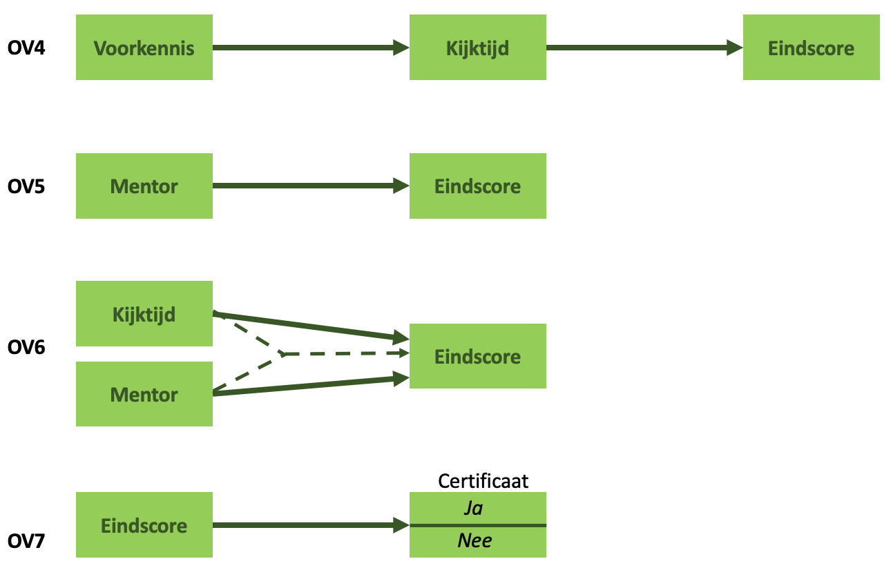

class: title-slide, center, middle

<style>
.center2 {
  margin: 0;
  position: absolute;
  top: 50%;
  left: 50%;
  -ms-transform: translate(-50%, -50%);
  transform: translate(-50%, -50%);
}
</style>

```{r ,warning=F,message=F,echo=F}
library(here)
library(dplyr)
library(knitr)
library(tidyr)
library(purrr)
library(ggplot2)
library(lavaan)
```

```{r setup, echo = FALSE}
knitr::opts_chunk$set(fig.retina = 3, warning = FALSE, message = FALSE)
```

```{css echo=FALSE}
.right-column{
  padding-top: 0;
}

.remark-code, .remark-inline-code { font-family: 'Source Code Pro', 'Lucida Console', Monaco, monospace;
                                    font-size: 90%;
                                  }


```

<div class="my-logo-left">  </div>


# GKN - Contactmoment 1
.font160[
.SW-greenD[Deel 1: Intro + herhaling ]
]
Sven De Maeyer & Bea Mertens

.font80[
.UA-red[
14/10/2021
]
]

---
class: inverse-green, center, middle

# Waarom *Gevorderde* Kwantitatieve Analyses?

*Weten we dan nog niet genoeg?*
---

## Wat zijn statistische modellen?

.UA-red[Statistische modellen = Golems... = robots... ]
.center2[
```{r, out.height = "35%", out.width="35%", eval = T, echo = F}

```
]

---

## Wat zijn statistische modellen?

.UA-red[Ze voeren uit wat je hen vraagt (zonder zelf na te denken) ...
]
.center2[
```{r, out.height = "50%", out.width="50%", eval = T, echo = F}

```
]

---

## Wat zijn statistische modellen?

.UA-red[Voor bepaalde onderzoeksproblemen zijn bepaalde statistische modellen handig. Maar! Ze kunnen ook gevaarlijk zijn!]

.center2[
```{r, out.height = "90%", out.width="90%", eval = T, echo = F}

```
]

---

## Wat zijn statistische modellen?

.UA-red[Niet alle statistische modellen zijn geschikt voor alle data ...]

```{r, echo = FALSE, message = FALSE, fig.width=6, fig.height=6, fig.align='center'}
nMinuten <- sample(seq(1:500),1000 , replace = T)
Score <- 45 + 2*nMinuten - 0.002*nMinuten^2 
Eindscore <- Score + rnorm(1000, 0 , 20)
library(ggplot2)
D <- data.frame(nMinuten,Eindscore)
P <- ggplot(D, aes(nMinuten,Eindscore)) + geom_point(color = 'red')
P + geom_smooth(method = "lm")
```
---

## Wat als?

.SW-greenD[vb. studie van Silberzahn et al. 2018 (voor artikel zie BB)]

<br>

> **Onderzoeksvraag:** Is het zo dat scheidsrechters in voetbal meer geneigd zijn gele en rode kaarten te geven aan spelers met een andere huidskleur?

<br>

29 onderzoeksteams gingen aan de slag met **dezelfde data**!

<br>

**Resultaat:**

- 69% v/d teams vond een significant effect, 31% niet...
- Analyse-aanpak van alle teams verschilde van elkaar

<br>

$\rightarrow$ .UA-red[Conclusie afhankelijk van statistisch model dat werd gehanteerd!]


---

## suRplus van GKN

Meervoudige regressie = één (breed) statistisch model

<br> Maar wat als je andere types van onderzoeksproblemen tegen komt? 

<br> Hier verruimen we je pallet aan beschikbare modellen:

- Structurele vergelijkingsmodellen (SEM)
<br>

- Multilevel modellen
<br>

- Logistische regressie modellen

---

class: inverse-green, center, middle

# Hoe gaan we de lessen aanpakken en welk leermateriaal is er?


---

## Het openleerpakket

.center2[
Op Blackboard vind je .SW-greenD[**OLP's**] voor de verschillende onderdelen

<br> 
Neem deze zoveel mogelijk .SW-greenD[**VOOR**] de contactmomenten door

<br>
Maak een .SW-greenD[**script**] aan dat je ook kan hanteren tijdens de lessen
]

---

## De lessen zelf
<br>

.SW-greenD[Deel 1:] 

- Overlopen van de theorie | belangrijkste punten uit het OLP
- Voorbeelden waarbij jullie actief mee gaan denken

 <br>
 
.SW-greenD[Deel 2:] 

- Ruimte voor oefenen (oefeningen met respons ter beschikking)
- Ruimte om aan de groepsopdracht te werken

<br>

$\rightarrow$ Breng een laptop mee indien mogelijk en/of werk samen!

---

## ZSO's

Per analysetechniek vind je op Blackboard een ZSO. Deze kan je facultatief maken. 

<br>

**Doel ZSO's:**

<br>

$\rightarrow$ Toepassing van de leerstof

<br>

$\rightarrow$ Voorbereiding voor de groepsopdracht

---
class: inverse-green, center, middle

# Hoe gaan we evalueren?


Groepsopdracht (paper) + Mondeling examen

---
class: middle

## Groepsopdracht - Doel

<br>


- Aantonen dat jullie de analysetechnieken beheersen en kunnen uitvoeren in R

<br>

- De essentie van een analyse rapporteren en bespreken (cfr. nodig voor masterproef)

<br>


- Helder rapporteren en komen tot conclusies op basis van analyses

<br>


---
class: middle

## Groepsopdracht - Middel


<br>


(1) Een **.SW-greenD[paper]** schrijven


<br>

Jullie krijgen een dataset uit het TIMSS 2019 onderzoek en bijhorende onderzoeksvragen


<br>

Zelfstandig de nodige analyses uitvoeren + rapporteren!

---
class: middle

## Groepsopdracht - Middel

<br>

(2) Ook een **.SW-greenD['net' scRipt]** opleveren 


<br>

- Bevat enkel de definitieve commando's

- Geannoteerd

- Volgt analyses zoals gepresenteerd in de paper

- Moet door een andere onderzoeker kunnen worden uitgevoerd en tot dezelfde resultaten leiden (= .UA-red[reproduceerbaar])

---
class: middle

## Groepsopdracht - Praktisch


<br>

De opdracht is een groepsopdracht! 

<br>

- Groepen van 3 studenten

- Vrij om zelf 2 medestudenten te kiezen

- Inschrijven in een groep via Blackboard (.UA-red[DEADLINE = zondag 17/10])

- Studenten zonder groep worden door ons aan elkaar of aan een groep met 2 studenten toegewezen

---
class: middle

## Groepsopdracht - Good practices en tips

<br>

- Mogelijkheid tot feedback via Comproved (info volgt)

- Werk samen!

- Get to know your data!

- 💡Vergeet statistiek A & B niet 💡

---
class: middle

## Groepsopdracht - Paper 

.SW-greenD[Structuur] van een wetenschappelijk artikel (bv. onderzoeksartikels in Pedagogische Studiën als inspiratie)

- 📃 6 A4's  

- Times New Roman, 11pt

<br>
.SW-greenD[Onderdelen:]

- Titelblad

- Methodologiesectie

- Resultaten per onderzoeksvraag

- Bijdrage van de auteurs

---
class: middle

## Groepsopdracht - Wat brengt de opdracht op?

Veel plezie.UA-red[R]

<iframe src="https://giphy.com/embed/1iv76C133MPHEwzkJC" width="480" height="270" frameBorder="0" class="giphy-embed" allowFullScreen></iframe><p><a href="https://giphy.com/gifs/kennedycenter-dancing-friday-feeling-national-dance-day-1iv76C133MPHEwzkJC"></a></p>


Maar vooral: .UA-red[**12 punten**] te verdienen

---
class: middle

## Mondeling examen - Doel

<br>

Aantonen dat je .UA-red[inzicht] hebt in de materie!

<br>

Dus we testen begrip en niet 'reproductieve kennis'

---
class: middle

## Mondeling examen - Vorm

<br>

Tijdens het mondeling examen stellen we .SW-greenD[vragen gerelateerd aan de paper] die je indiende

<br>

Op het moment zelf .SW-greenD[geen voorbereiding]

<br>

Kom voorbereid naar het examen: je .SW-greenD[eigen paper is de leidraad] om het mondeling examen af te leggen

---
class: middle

## Mondeling examen - Wat brengt het mondeling examen op?

Liefst niet te veel st.SW-greenD[**R**]ess

.pull-left[
<iframe src="https://giphy.com/embed/xT5LMz2DWrwmbfVBK0" width="480" height="320" frameBorder="0" class="giphy-embed" allowFullScreen></iframe><p><a href="https://giphy.com/gifs/season-11-the-simpsons-11x19-xT5LMz2DWrwmbfVBK0"></a></p>
]

.pull-right[
<iframe src="https://giphy.com/embed/MMfROK5szfy" width="480" height="320" frameBorder="0" class="giphy-embed" allowFullScreen></iframe><p><a href="https://giphy.com/gifs/e3-2015-sweetrolltxt-MMfROK5szfy"></a></p>
]

<br>


En vooral: **.UA-red[8 punten]** te verdienen

---
class: inverse-blue, center, middle

# Herhaling statistiek B

---
class: middle

## Analysemodellen

Statistiek B: 

.SW-greenD[van onderzoeksvraag naar analysemodel]

<br>

Vertrekpunt: 

.SW-greenD[schematische voorstelling]

---

## 🏃🏽‍️ Analysemodellen - Oefening 1 🏃🏽‍

Visualiseer onderstaande onderzoeksvragen (samen met je buur)


> *Context: onderzoek naar effectiviteit van online trainingstraject 'Machine Learning'*

<br>

- OV1: Wat is het effect van 'kijktijd' (aantal minuten kennisclip bekeken) op de eindscore die trainees behalen (z-score)?


- OV2: Is er een effect van 'kijktijd' op de eindscore die trainees behalen (z-score) ongeacht de voorkennis (gemeten adhv een parallelle toets, z-score)?


- OV3: Is het effect van 'kijktijd' op de eindscore die trainees behalen (z-score) afhankelijk van de voorkennis (z-score)

---

## Analysemodellen - Oefening 1 - oplossingen 

```{r, out.height = "50%", out.width="50%", eval = T, echo = F}

```

---

## 🏃🏽‍ Analysemodellen - Oefening 2 🏃🏽‍

De training wordt gemodereerd door 20 verschillende mentoren en elke mentor begeleid 15 trainees

<br>

- OV4: Leidt voorkennis (z-score) tot een andere leeractiviteit ('kijktijd') en bijgevolg tot andere eindresultaten?


- OV5: Is er een effect van de mentor die een trainee krijgt toegewezen op de eindscore die trainees behalen (z-score)?


- OV6: Is het effect van 'kijktijd' op de eindscore die trainees behalen (z-score) afhankelijk van de mentor die een trainee krijgt toegewezen?


- OV7: In hoeverre is de eindscore die trainees behalen (z-score) voorspellend voor het al dan niet behalen van het certificaat?}

---

## Analysemodellen - Oefening 2 - oplossingen

```{r, out.height = "50%", out.width="50%", eval = T, echo = F}

```

---

## Regressieanalyse?

Wanneer pas je regressieanalyse toe?

Wat zijn de assumpties achter regressieanalyse?

```{r, out.height = "60%", out.width="60%", eval = T, echo = F}

```

---

## Regressieanalyse: visueel

```{r, echo = F,message=F, fig.width = 6, fig.height= 6,fig.align="center"}
set.seed(1975)
nMinuten <- sample(seq(1:500),1000 , replace = T)
Score <- 45 + 2*nMinuten
set.seed(1975)
Eindscore <- Score + rnorm(1000, 0 , 20)
library(ggplot2)
D <- data.frame(nMinuten,Eindscore)
P <- ggplot(D, aes(nMinuten,Eindscore)) + geom_point(color = 'red')
P + geom_smooth(method = "lm")
```

---

## Regressieanalyse: formule

<br>

$$y_{i}=\beta_0 + \beta_1 * x_i + \epsilon_{ij}$$

<br>
<br>

met:

- $\beta_0$ = het intercept (verwachte score voor $y$ indien $x_i$ gelijk is aan 0)
- $\beta_1$ = slope (verwachte stijging/daling in score $y$ als $x_i$ met 1 eenheid stijgt)

---

## Regressieanalyse: formule

.pull-left[
$$Eindscore_{i}= 45 + 2 * nMinuten + \epsilon_{ij}$$


```{r, echo = F,message=F, fig.height=6, fig.width=6,fig.align="center"}
set.seed(1975)
nMinuten <- sample(seq(1:500),1000 , replace = T)
Score <- 45 + 2*nMinuten
set.seed(1975)
Eindscore <- Score + rnorm(1000, 0 , 20)
library(ggplot2)
D <- data.frame(nMinuten,Eindscore)
P <- ggplot(D, aes(nMinuten,Eindscore)) + geom_point(color = 'red')
P + geom_smooth(method = "lm")
```
]
.pull-right[
- Verwachte eindscore als je 0 minuten kennisclips bekeek = ?
- Verwachte eindscore als je 2 minuten kennisclips bekeek = ?
- Verwachte eindscore als je 20 minuten kennisclips bekeek = ?
]
---

## Een eenvoudig voorbeeld...

Een voorbeeldje met PIRLS 2016 data van Vlaanderen ...

<br> 
.SW-greenD[
> Heeft de mate waarin leerlingen vinden dat ze actief betrokken worden in de taallessen (Betrokkenheid, variabele '`ASBGERL`') een invloed op de score van begrijpend lezen (Leesvaardigheid, variabele '`ASRREA01`')?
]
---

## Bivariate regressieanalyse (1)

*Eerst de dataset en de variabelen herbenoemen*

<br>


```{r, echo = T}
load(here("C1", "Data", "Vlaanderen_1_2_3.RData"))
Vlaanderen                 <- Vlaanderen_1_2_3
Vlaanderen$Betrokkenheid   <- as.numeric(Vlaanderen$ASBGERL)
Vlaanderen$Leesvaardigheid <- as.numeric(Vlaanderen$ASRREA01)
```

.footnote[🗒️Hier gebruik ik het pakket `here` wat maakt dat ik geen lange paden naar files op m'n pc dien in te voeren in het stukje `load()`. Zelf moet je vooral goed verwijzen naar de plaats waar je file staat. Of je moet leren werken met `here` natuurlijk http://jenrichmond.rbind.io/post/how-to-use-the-here-package/]

---

## Bivariate regressieanalyse (2)

.pull-left[*Dan een grafiek maken*]

.pull-right[
```{r, echo = F, message = F, warning = F, fig.height=6, fig.width=6, fig.align="center"}
P1 <- ggplot(Vlaanderen, aes(x=Betrokkenheid, y=Leesvaardigheid)) +    
      geom_point(color = 'red')
P2 <- P1 + geom_smooth(method = "lm")
P2
```
]
---

## Bivariate regressieanalyse (3)
.pull-left[
*Schat het model*

.footnotesize[
```{r, echo = T }
Model1 <- lm(Leesvaardigheid ~ Betrokkenheid,
             data = Vlaanderen)
summary(Model1)
```
]
]

.pull-right[

**Intercept?** 

**Betrokkenheidheid?**

**Model?**

]
---

## Wat als er meerdere onafhankelijke variabelen zijn? (1)

Meerdere onafhankelijke variabelen...

- Variabele '`ASBHPLR`' = mate waarin ouders aangeven graag te lezen (Leesplezier)
- Variabele '`ASBGDDH`' = het aantal digitale devices in huis (Devices)

---

## Meervoudige regressieanalyse (1)

.pull-left[*Herbenoem de variabelen en schat het model*

.footnotesize[
```{r, , echo = T , size = "tiny", comment=""}
Vlaanderen$Leesplezier <- as.numeric(Vlaanderen$ASBHPLR)
Vlaanderen$Devices     <- as.numeric(Vlaanderen$ASBGDDH)

Model2 <- lm(
  Leesvaardigheid ~ Betrokkenheid + Leesplezier + Devices,
  data = Vlaanderen)
summary(Model2)
```
]
]

.pull-right[
**Welke variabele heeft het sterkste effect?**]

---

## Meervoudige regressieanalyse (2)

*Standaardiseer alle kwantitatieve variabelen*

.footnotesize[
```{r, , echo = T , comment = ""}
Vlaanderen$LeesvaardigheidZ <- scale(Vlaanderen$Leesvaardigheid)
Vlaanderen$BetrokkenheidZ   <- scale(Vlaanderen$Betrokkenheid)
Vlaanderen$LeesplezierZ     <- scale(Vlaanderen$Leesplezier)
Vlaanderen$DevicesZ         <- scale(Vlaanderen$Devices)
```
]
---

## Meervoudige regressieanalyse (3)

*Herschat het model*

.footnotesize[
```{r, , echo = F , size = "tiny", comment = "", eval = T}
Model3 <- lm(LeesvaardigheidZ ~ BetrokkenheidZ + LeesplezierZ + DevicesZ, data = Vlaanderen)
summary(Model3)
```
]
---

## Oh nee... een categorische onafhankelijke variabele?

<br>

*Wat als we ook categorische variabelen als onafhankelijke variabelen willen toevoegen?*

<br>

Stel we willen controleren voor de variabele 'Geslacht' 

(variabele `ASBG01` waarbij 1 = Girl en 2 = Boy)

---

## Regressieanalyse met een categorische onafh. variabele (1)

*Herbenoem de variabele*   

*Controleer of het een factor is*


```{r, echo = T}
Vlaanderen$Geslacht <- Vlaanderen$ASBG01
is.factor(Vlaanderen$Geslacht)
```

<br>
Wat zou er gebeuren als we de variabele `Geslacht` zo zouden toevoegen aan het model?

---

## Regressieanalyse met een categorische onafh. variabele (2)
.pull-left[
*Schat het model*

.footnotesize[
```{r, , echo = F , comment="", size = "tiny", eval = T}
Model3 <- lm(LeesvaardigheidZ ~ BetrokkenheidZ + LeesplezierZ + DevicesZ + Geslacht,
             data = Vlaanderen)
summary(Model3)
```
]
]
.pull-right[
**Hoe moeten we hier het intercept interpreteren?**
]

---

## Regressieanalyse met een categorische onafh. variabele (3)

<br>

Maak een factor van de variabele `Geslacht`

<br>

```{r, , echo = T , eval = T}
Vlaanderen$GeslachtF <- as.factor(Vlaanderen$Geslacht)
```

---

## Regressieanalyse met een categorische onafh. variabele (4)

.pull-left[
*Herschat het model*

.footnotesize[
```{r, , echo = T , eval = T}
Model3 <- lm(LeesvaardigheidZ ~ BetrokkenheidZ + LeesplezierZ + 
               DevicesZ + GeslachtF, data = Vlaanderen)
summary(Model3)
```
]
]

.pull-right[
**Hoe kunnen we hier het intercept interpreteren?**
]

---

## Een laatste voorbeeld...

Hoe teken je alweer het model dat bij volgende onderzoeksvraag hoort?

<br>

> Is het verband tussen de mate dat ouders aangeven graag te lezen en de scores die leerlingen halen op begrijpend lezen anders voor jongens dan voor meisjes?


<br>

Hoe te modelleren in R? Wat impliceert dit?

---

## Interactie-effecten (1)

.pull-left[
.footnotesize[
```{r, , echo = T , comment="", size = "tiny", eval = T}
Model4 <- lm(LeesvaardigheidZ ~ LeesplezierZ + 
               GeslachtF + LeesplezierZ*GeslachtF, 
             data = Vlaanderen)
summary(Model4)
```
]
]
.pull-right[
**Conclusie?**
]
---

## Interactie-effecten (2)

Het interactie-effect (ook al is het niet significant) even visueel

```{r, echo = F, fig.width=6,fig.height=6, fig.align="center"}
LeesplezierZ <- rnorm(1000,0,1)
Geslacht     <- c(rep(0,500),rep(1,500))
Predicted_leesscore <- 0.1236 + 0.19689 * LeesplezierZ - 0.16 * Geslacht + 0.04 * LeesplezierZ * Geslacht
D <- data.frame(LeesplezierZ, Geslacht, Predicted_leesscore)
D$Geslacht <- as.factor(D$Geslacht)
P <- ggplot(D, aes(LeesplezierZ,Predicted_leesscore, colour=Geslacht)) + geom_line() 
P + annotate(geom = "text",x=-1, y=0.15, label="Intercept Girl = 0.1236") + annotate(geom = "point" , x=0, y=0.1236) + annotate(geom = "text",x=1.5, y=-0.06, label="Intercept Boy = 0.1236 - 0.16 = -0.0364") + annotate(geom = "point" , x=0, y=-0.0364)
```

---

## Interactie-effecten (3)

Interactie-effecten tussen twee KWANtitatieve verklarende variabelen?

.footnotesize[
```{r, , echo = T , comment = "", size = "tiny", eval = T}
Model5 <- lm(LeesvaardigheidZ ~ BetrokkenheidZ + LeesplezierZ + DevicesZ + GeslachtF + BetrokkenheidZ*DevicesZ , data = Vlaanderen)
summary(Model5)
```
]

---

## Interactie-effecten (4)

Het interactie-effect (ook al is het niet significant) even visueel


```{r, echo = F, fig.width = 6, fig.height=6, fig.align="align"}
BetrokkenheidZ <- rnorm(1000,0,1)
DevicesZ <- c(rep(-2,200),rep(-1,200),rep(0,200),rep(1,200),rep(2,200))
Predicted_leesscore <- 0.12765 + 0.02445 * BetrokkenheidZ + 0.03794 * DevicesZ + 0.01757 * BetrokkenheidZ * DevicesZ
D <- data.frame(BetrokkenheidZ, DevicesZ, Predicted_leesscore)
P <- ggplot(D, aes(BetrokkenheidZ,Predicted_leesscore, colour=DevicesZ,group = DevicesZ)) + geom_line() 
P 
```

---

## Interactie-effecten (4)

Hetzelfde interactie-effect even visueel (maar dan "andersom") 


```{r, echo = F, fig.width = 6, fig.height=6, fig.align="align"}
DevicesZ <- rnorm(1000,0,1)
BetrokkenheidZ <- c(rep(-2,200),rep(-1,200),rep(0,200),rep(1,200),rep(2,200))
Predicted_leesscore <- 0.12765 + 0.02445 * BetrokkenheidZ + 0.03794 * DevicesZ + 0.01757 * BetrokkenheidZ * DevicesZ
D <- data.frame(BetrokkenheidZ, DevicesZ, Predicted_leesscore)
P <- ggplot(D, aes(DevicesZ,Predicted_leesscore, colour=BetrokkenheidZ, group = BetrokkenheidZ)) + geom_line() 
P 
```


---
class: inverse-red, center, middle

## We zijn weer helemaal bij

*Tijd voor een pauze*


