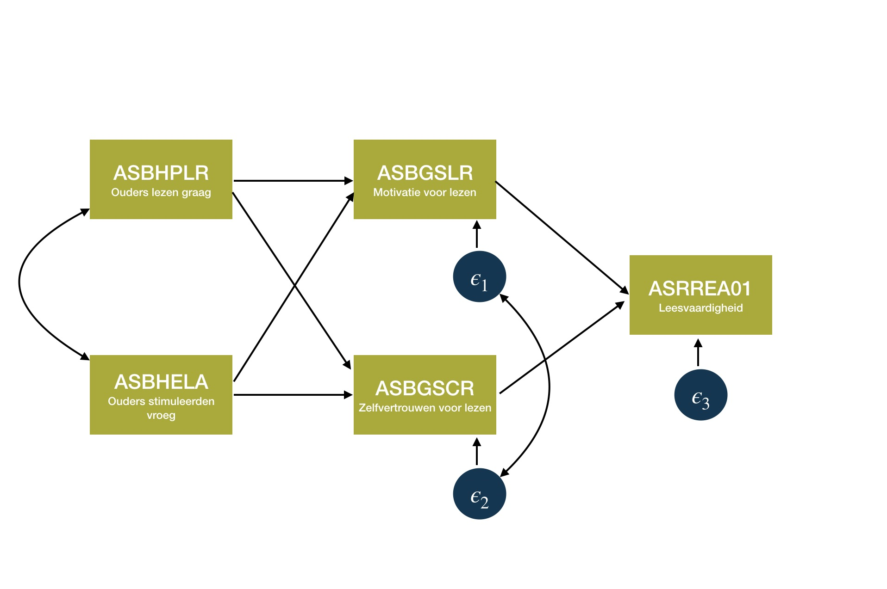

class: title-slide, center, middle

<style>
.center2 {
  margin: 0;
  position: absolute;
  top: 50%;
  left: 50%;
  -ms-transform: translate(-50%, -50%);
  transform: translate(-50%, -50%);
}
</style>

```{r ,warning=F,message=F,echo=F}
library(here)
library(dplyr)
library(knitr)
library(tidyr)
library(purrr)
library(ggplot2)
library(lavaan)
```

```{r setup, echo = FALSE}
knitr::opts_chunk$set(fig.retina = 3, warning = FALSE, message = FALSE)
```

```{css echo=FALSE}
.right-column{
  padding-top: 0;
}

.remark-code, .remark-inline-code { font-family: 'Source Code Pro', 'Lucida Console', Monaco, monospace;
                                    font-size: 75%;
                                  }


```

<div class="my-logo-left">  </div>


# GKN - Contactmoment 1
.font160[
.SW-greenD[Deel 2: Structurele Vergelijkingsmodellen]
]
Sven De Maeyer & Bea Mertens

.font80[
.UA-red[
14/10/2021
]
]

---
class: inverse-green, center, middle

# Het padmodel

Laat maar komen, die indirecte effecten ...

---

## Uit het vorige deel...

Even hernemen:

<br>

>.SW-greenD[Leidt voorkennis (z-score) tot een andere leeractiviteit ('kijktijd') en bijgevolg tot andere eindresultaten?]

<br>

Voorkennis $\rightarrow$ nMinuten $\rightarrow$ Eindtoets 

---

## Van eenvoudig

```{r, out.height = "75%", out.width="75%", eval = T, echo = F}

```

---

## Naar minder eenvoudig

```{r, out.height = "75%", out.width="75%", eval = T, echo = F}

```

---

## Naar complex

```{r, out.height = "75%", out.width="75%", eval = T, echo = F}

```

---

## Tot zeer complex

```{r, out.height = "75%", out.width="75%", eval = T, echo = F}

```

---

## De onderdelen uit een padmodel

```{r, out.height = "75%", out.width="75%", eval = T, echo = F}

```

---

## Hoe het padmodel 'toetsen' en 'schatten'

Hiervoor hanteren we **.UA-red[Structurele Vergelijkingsmodellen]**

<br>

oftewel **.UA-red[Structural Equation Modelling (SEM)]**

<br>

= veelzijdig statistisch model o.a. gehanteerd voor het testen van padmodellen

---
class: inverse-green, center, middle

# Lavaan

*.UA-red[La]tent .UA-red[Va]riable .UA-red[An]alysis*

---
## Lavaan

Verschillende pakketten in R om SEM uit te voeren

<br>

Wij hanteren .UA-red[`lavaan`] (Eerst installeren!) 

```{r, echo = T , eval = F, warning = F , message = F}
library(lavaan)
```

<br>

[website van het lavaan project: http://lavaan.ugent.be/tutorial/index.html](http://lavaan.ugent.be/tutorial/index.html)

---

## Workflow lavaan

```{r, eval = F, echo = T}
# STAP 1: Model definiëren 

Model1 <- 'y ~ x1 + x3
          x3 ~ x4 + x5'

# STAP 2: Model analyseren op basis van dataset ‘Data’ 

Fit_Model1 <- sem(Model1, data = Data, fixed.x = FALSE)

# STAP 3: Output bekijken en interpreteren 

summary(Fit_Model1, fit.measures = TRUE, standardized = TRUE)
```

---

## Een eenvoudig voorbeeld uit PIRLS

> .SW-greenD[In hoeverre hebben de mate waarin ouders graag lezen (variabele 'Leesplezier'), kinderen van jongsaf aan stimuleren om te lezen (variabele 'Stimuleren'), de leesmotivatie van jongeren (variabele 'Motivatie') en zelfvertrouwen van jongeren voor lezen (variabele 'Zelfvertrouwen') een effect op de leesvaardigheid van jongeren (variabele 'Leesvaardigheid')?]

<br>

*Hoe visualiseren?*

<br>

*Welke parameters gaan geschat worden?*

---

## Eenvoudig voorbeeld - visueel


```{r, out.height = "75%", out.width="75%", eval = T, echo = F}
knitr::include_graphics("Fig/Padmodel_PIRLS_M1.jpg")
```

---

## Eenvoudig voorbeeld - in lavaan

.footnotesize[
```{r, echo=F}
load(here("C1", "Data", "Vlaanderen_1_2_3.Rdata"))
Vlaanderen <- Vlaanderen_1_2_3
Vlaanderen$Leesplezier     <- Vlaanderen$ASBHPLR
Vlaanderen$Stimuleren      <- Vlaanderen$ASBHELA
Vlaanderen$Motivatie       <- Vlaanderen$ASBGSLR
Vlaanderen$Zelfvertrouwen  <- Vlaanderen$ASBGSCR
Vlaanderen$Leesvaardigheid <- Vlaanderen$ASRREA01
```

<br>
<br>

```{r, eval = F, echo = T, size = "tiny", comment=""}
PIRLS_M1 <- 'Leesvaardigheid ~ Leesplezier + Stimuleren + Motivatie + Zelfvertrouwen'

Fit_PIRLS_M1 <- sem(PIRLS_M1, data = Vlaanderen)

summary(Fit_PIRLS_M1, standardized = T, rsq = T)
```

]

<br>
.footnote[🗒️ *Het argument ```rsq = T``` staat niet vermeld in het OLP!*]

---

.footnotesize[
```{r, eval = T, echo = F, warning = F, error = F}
PIRLS_M1 <- 'Leesvaardigheid ~ Leesplezier + Stimuleren + Motivatie + Zelfvertrouwen'
Fit_PIRLS_M1 <- sem(PIRLS_M1, data = Vlaanderen)
summary(Fit_PIRLS_M1, standardized = T, rsq = T)
```
]

---
## Eenvoudig voorbeeld - resultaten

```{r, out.height = "75%", out.width="75%", eval = T, echo = F}

```

---

## Samenhang tussen de onafhankelijke variabelen?

```{r, out.height = "75%", out.width="75%", eval = T, echo = F}

```

---

## Samenhang tussen onafh. var. - in lavaan

```{r, eval = F, echo = T, warning = F, size="tiny"}
PIRLS_M1a <- 'Leesvaardigheid ~ Leesplezier + Stimuleren + Motivatie + Zelfvertrouwen'

Fit_PIRLS_M1a <- sem(PIRLS_M1a, fixed.x = F, data = Vlaanderen)

summary(Fit_PIRLS_M1a, standardized = T, rsq = T)
```

<br>

Het argument **.SW-greenD[`fixed.x = F`]** werd toegevoegd!

---

```{r, out.height = "45%", out.width="45%", eval = T, echo = F}

```

---

## Een echt padmodel

>.SW-greenD[In hoeverre hebben de mate waarin ouders graag lezen (variabele 'Leesplezier') en hun kinderen al vroeg stimuleerden om te lezen (variabele 'Stimuleren') via zowel de motivatie om te lezen van leerlingen (variabele 'Motivatie') als hun zelfvertrouwen voor lezen (variabele 'Zelfvertrouwen') een onrechtstreeks effect op de leesvaardigheid van jongeren (variabele 'Leesvaardigheid')?]

<br>

*Hoe visualiseren?*

<br>

*Welke parameters gaan geschat worden?*

---

## Een echt padmodel - visueel

```{r, out.height = "75%", out.width="75%", eval = T, echo = F}

```

---

## Een echt padmodel - in lavaan

```{r , eval = F, echo = T, size = "tiny", comment="", warning=F}
PIRLS_M2 <- ' Leesvaardigheid ~ Motivatie + Zelfvertrouwen 
              Motivatie       ~ Leesplezier + Stimuleren
              Zelfvertrouwen  ~ Leesplezier + Stimuleren
              Motivatie       ~~ Zelfvertrouwen'

Fit_PIRLS_M2 <- sem(PIRLS_M2, fixed.x = F, data = Vlaanderen)

summary(Fit_PIRLS_M2, standardized = T, rsq = T)
```

---

## Een echt padmodel - resultaten

```{r, out.height = "45%", out.width="45%", eval = T, echo = F}
knitr::include_graphics("Fig/Output_pad_A2.png")
```

---

## Een echt padmodel - resultaten visueel

```{r, out.height = "75%", out.width="75%", eval = T, echo = F}
knitr::include_graphics("Fig/Padmodel_PIRLS_M2_resultaten.jpg")
```

---

## Syntax van lavaan

.center2[
| Type                | Teken in lavaan        |  mnemonic                             |
|:--------------------|:-----------------------|:--------------------------------------|
| regressie           |  A $\sim$ B            | A is afhankelijk van B              | 
| covariantie         |  A $\sim\sim$ B        | A hangt samen met B                 | 
| latente variabele   |  A $=\sim$ B + C + ... | A wordt gemeten door B, C, en ...   |
]


---
class: inverse-green, middle, center

# Model Fit

Is er wel een goede fit tussen data en model?

---

## Hoe goed is het model?

Vaak meerdere 'concurrerende' modellen

<br>

OF één model op zich

<br>

*Cruciale vragen: welk model is het best? hoe goed is elk/het model?*

---
## Logica achter SEM

Bij regressieanalyse was de logica om te zoeken naar die schattingen van parameters die ervoor zorgen dat de som van de $\epsilon_i$ zo klein mogelijk is!

<br>

Bij SEM werkt het anders! 

---
## Logica achter SEM

Stel 3 kenmerken gemeten bij 5 respondenten


$+$ theorie zegt dat kenmerk C een functie is van A en B:

<br>

$$C = A + 0.5 * B $$

<br>

*Hoe zou jij deze theorie intuïtief testen?*

<br>

| Respondent | Kenmerk A | Kenmerk B | Kenmerk C |
|:----------:|:---------:|:---------:|:---------:|
|     1      |     3     |    3.5    |      ?    |
|     2      |     4     |     5     |      ?    |
|     3      |     3     |     4     |      ?    |
|     4      |     1     |     3     |      ?    |

---
## Logica achter SEM

Vastgestelde waarden worden vergeleken met verwachte waarden volgens het theoretische model (cfr. kruistabellen)

<br>

.UA-red[NIET individuele scores] zoals bij regressie: 

- voorspelde score 
- tov. geobserveerde score (verschil = $\epsilon_i$)

<br>

.UA-red[WEL de variantie-covariantiematrix tussen variabelen]:

-	voorspelde matrix $\Sigma$ 
- tov. geobserveerde matrix S

---

## Een echt padmodel - visueel

$\Sigma$ de verwachte variantie- covariantiematrix gegeven onderstaand model 

<br>
```{r, out.height = "75%", out.width="75%", eval = T, echo = F}

```

---

## Een echt padmodel - matrices vergeleken

```{r , echo = F, warning = F, message = F, error = F, comment=""}
PIRLS_M2 <- ' Leesvaardigheid ~ Motivatie + Zelfvertrouwen 
              Motivatie       ~ Leesplezier + Stimuleren
              Zelfvertrouwen  ~ Leesplezier + Stimuleren
              Motivatie       ~~ Zelfvertrouwen'
Fit_PIRLS_M2 <- sem(PIRLS_M2, fixed.x = F, data = Vlaanderen)
```

Verwachte varianties en covarianties: 
.footnotesize[
```{r , echo = T , message = F, error = F, warning = F, comment="", size = "tiny"}
fitted(Fit_PIRLS_M2)
```
]

Geobserveerde varianties en covarianties: 
.footnotesize[
```{r , echo = T, message = F, error = F, warning = F , size = "tiny", comment=""}
Vars <- na.omit(Vlaanderen[,c("Leesvaardigheid", "Leesplezier", "Stimuleren", "Motivatie", "Zelfvertrouwen")])
round(cov(Vars),2)
```
]

---

## Fit indices

We kunnen beide matrices 'op het zicht' vergelijken, maar beter om hier een maat voor te hebben.

<br>

Er zijn er 'een hele hoop'. Wij hanteren:

- Chi-kwadraat toets;
- beschrijvende fit indices (bv. CFI);
- RMSEA

---
## Chi-kwadraattoets

.SW-greenD[Chi-kwadraat waarde] drukt uit hoe sterk beide matrices (S en $\Sigma$) van elkaar verschillen

- Chi-kwadraat waarde *laag* = goed teken
- Chi-kwadraat waarde *hoog* = slecht teken

<br>
Bijhorende significantietoets drukt uit of de Chi-kwadraat waarde **.UA-red[significant afwijkt van nul]**

- p-waarde > 0.05 = goed teken
- p-waarde < 0.05 = slecht teken

<br>
Let op! Deze toets is enkel waardevol indien steekproefgrootte (= *n*) niet te groot is!     
(Ruwe richtlijn: als *n* > 500, niet te hard vertrouwen op Chi-kwadraat toets)

---
## CFI

Chi-kwadraat toets is afhankelijk van steekproefgrootte

<br>

$\rightarrow$ Statistici hebben andere **beschrijvende fit indices** ontwikkeld

<br>
CFI (comparative fit index)

**LOGICA**: analoog aan $R^2$ in regressie. 

- Kan waarde aannemen tussen 0 en 1
- Hoe dichter tegen 1 hoe beter het model de verschillen verklaart
- Vuistregel: goed model **CFI** > 0.95

---

## RMSEA

Alternatieve, vaak gerapporteerde, fit index = **Root Mean Square of Approximation**

- RMSEA $\le$ 0.05 wijst op een *goed* model!!
- RMSEA tussen 0.05 en 0.08 = *aanvaardbaar*

---

## Fit voor het echte padmodel

```{r, echo = T, size = "tiny", comment=""}
fitMeasures(Fit_PIRLS_M2, 
            c("npar","chisq","df","pvalue","cfi","rmsea"))
```

<br>
Zelfde informatie krijg je ook indien je `summary(Fit_PIRLS_M2)` hanteert

---

## Modellen vergelijken qua fit

Bij twee of meerdere alternatieve modellen kan je ook modellen vergelijken en kijken welk model best bij de data past

- .SW-greenD[geneste modellen]: verschil in Chi-kwadraat toets + **AIC** (hoe lager hoe beter);
- .SW-greenD[niet-geneste modellen]: **AIC** (hoe lager hoe beter)

<br>
(Niet-geneste modellen zijn modellen waarvan het één .UA-red[geen vereenvoudiging] is van het andere (komt niet zo vaak voor).)

---

## PIRLS voorbeeld  - vergelijking Model1a en Model2

Zijn 2 geneste modellen

```{r , eval = T, echo = T, warning = F , size = "tiny", comment=""}
anova(Fit_PIRLS_M1, Fit_PIRLS_M2)
```

$\rightarrow$ Model2 significant hogere Chi-kwadraat waarde (dus "slechter" model)
$\rightarrow$ Model2 **AIC** hoger (dus "slechter" model)

<br>
Het model1 is echter 'verzadigd' (geen vrijheidsgraden (zie kolom `df`), dus perfecte fit!)

<br>
Maw, geen interessant model!
---
class: inverse-red, middle, center

# Time to pRactice!

**Oefeningen en respons** terug te vinden op BB
