class: title-slide, center, middle

<style>
.center2 {
  margin: 0;
  position: absolute;
  top: 50%;
  left: 50%;
  -ms-transform: translate(-50%, -50%);
  transform: translate(-50%, -50%);
}
</style>

```{r ,warning=F,message=F,echo=F}
library(here)
library(dplyr)
library(knitr)
library(tidyr)
library(purrr)
library(ggplot2)
library(lavaan)
```

```{r setup, echo = FALSE}
knitr::opts_chunk$set(fig.retina = 3, warning = FALSE, message = FALSE)
```

```{css echo=FALSE}
.right-column{
  padding-top: 0;
}

.remark-code, .remark-inline-code { font-family: 'Source Code Pro', 'Lucida Console', Monaco, monospace;
                                    font-size: 75%;
                                  }


```


<div class="my-logo-left">  </div>


# GKN - Contactmoment 2
.font160[
.SW-greenD[Structurele Vergelijkingsmodellen (vervolg)] 
]
Sven De Maeyer & Bea Mertens

.font80[
.UA-red[
21/10/2021
]
]

---
class: inverse-green, center, middle

# Herhaling contactmoment 1

*Be Kind and Rewind*

---

## Een echt padmodel - Visueel

```{r, out.height = "75%", out.width="75%", eval = T, echo = F}
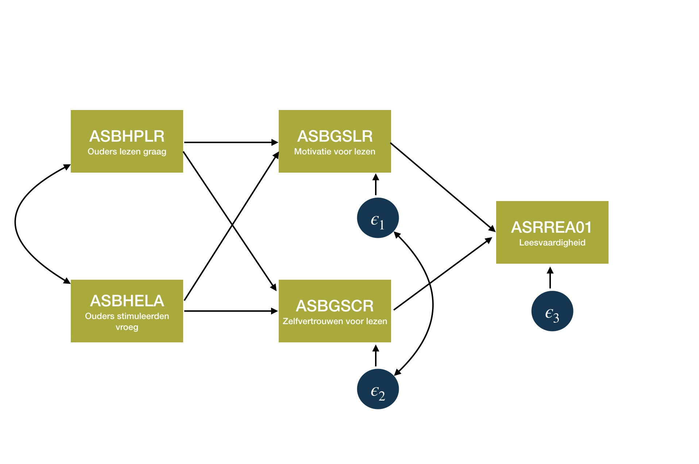
```

---
## Een echt padmodel - lavaan

```{r , eval = F, echo = T, comment="", warning=F}
PIRLS_M2 <- ' Leesvaardigheid ~ Motivatie + Zelfvertrouwen 
              Motivatie       ~ Leesplezier + Stimuleren
              Zelfvertrouwen  ~ Leesplezier + Stimuleren
              Motivatie       ~~ Zelfvertrouwen'

Fit_PIRLS_M2 <- sem(PIRLS_M2, fixed.x = F, data = Vlaanderen)

summary(Fit_Pirls_M2, standardized = T, rsq = T)
```

---

## Een echt padmodel - Resultaten

```{r, out.height = "50%", out.width="50%", eval = T, echo = F}
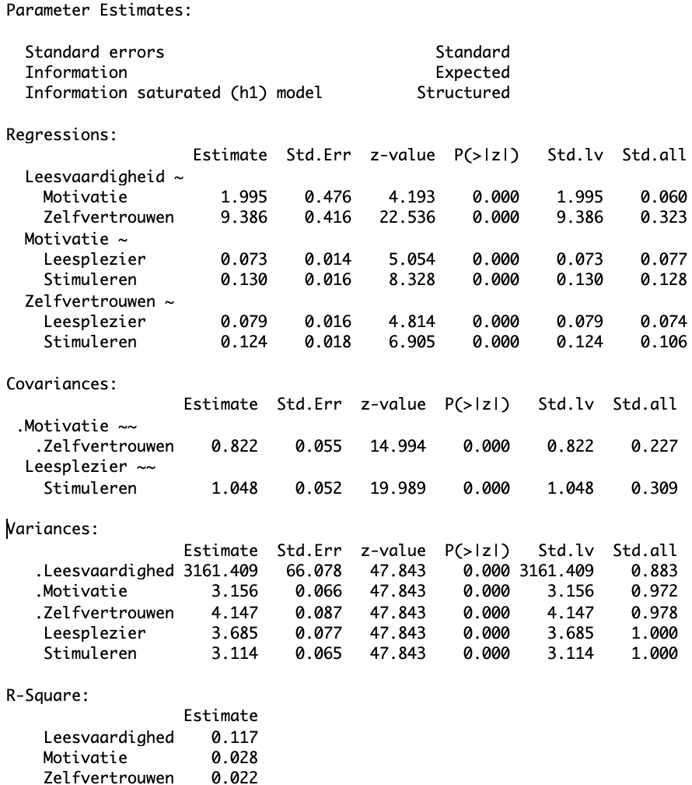
```

---

## Een echt padmodel - Resultaten visueel

```{r, out.height = "75%", out.width="75%", eval = T, echo = F}
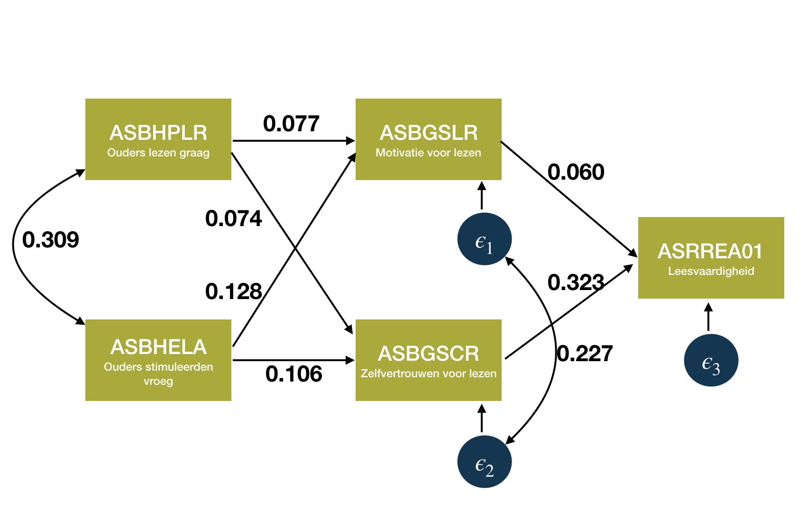
```

---

## Hoe goed is dat padmodel?

Andere logica dan bij regressieanalyse...

<br>

- Geobserveerde variantie-covariantiematrix wordt vergeleken met verwachte variantie-covariantiematrix  (cfr. kruistabellen)
       
- Hoe verschillend zijn beiden? (Waarbij we 'hopen' dat het verschil zo klein mogelijk is) 
       
- .SW-greenD[FIT INDICES!]

---

## Fit indices

Onderstaande tabel geeft een overzicht van de fit indices die we hanteren

<br>

.center2[
| Fit Index           | Wanneer ok? |
|:--------------------|:-------------------------------------------|
| $Chi^2$ - toets     |  Hoe lager, hoe beter ( $p>0.05$ )         |
| CFI                 |  Goed model $CFI > 0.95$                  | 
| RMSEA               |  Goed: $\le 0.05$ aanvaardbaar: $\le 0.08$ | 
]


---

## Een echt padmodel - Model fit

```{r, out.height = "40%", out.width="40%", eval = T, echo = F}
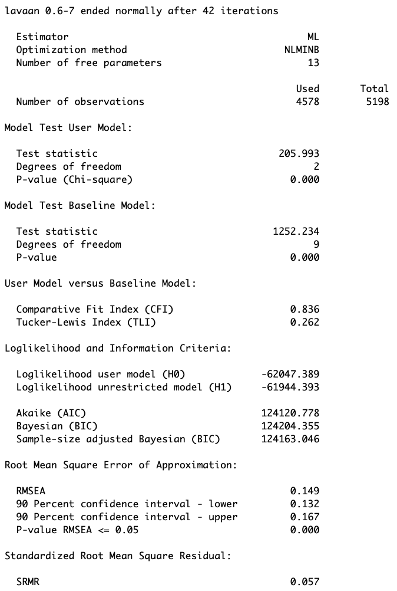
```

---
class: inverse-green, center, middle

# Confirmatieve Factor Analyse (CFA)

*Laat ons theorie de voorrang geven*

```{r, echo = F, warning = F, message = F, error = F}
load(here("C2", "Doorlichting.RData"))
```

---

## Meervoudige metingen

*Ik geef les in een anderstalige context …*

1. omdat ik er graag mee bezig ben.
2. omdat anderen dit van mij verwachten.
3. omdat ik het erg boeiend vind.
4. opdat anderen me vaardig zouden vinden.
5. omdat ik nieuwe zaken wil leren.
6. omdat anderen (collega’s/school/directie) mij daartoe verplichten.
7. omdat het me erg interesseert.
8. omdat ik me schuldig voel als ik het niet doe.
9. omdat ik het leuk vind om met anderstalige leerlingen te werken.
10. omdat ik wil dat anderen me een goede leerkracht vinden.
11. omdat ik me beschaamd voel als ik het niet doe.
12. omdat ik ervoor kies om met anderstalige leerlingen te werken.
13. omdat dit voor mij persoonlijk een belangrijke doelstelling is. 
14. omdat ik dit zelf erg waardevol vind om te doen.
15. ik weet niet waarom, ik zie niet welk verschil dit uitmaakt.

---
## Zelfdeterminatie theorie


- Intrinsieke motivatie: items 1, 3, 7 en 9

<br>

- Geïdentificeerde motivatie: items 5, 12, 13 en 14

<br>

- Geïntrojecteerde motivatie: items 4, 8, 10 en 12

<br>

- Externe motivatie: items 2 en 6

<br>

- Amotivatie: item 15


---

## Manifeste en Latente variabelen

Intrinsieke motivatie is .UA-red[**niet direct waarneembaar**] en vertaalbaar in een betrouwbaar cijfer


= .SW-greenD[**LATENTE VARIABELE**]

<br>
<br>

Wel kunnen we beroep doen op ‘indicatoren’ die .UA-red[**wel rechtstreeks meetbaar**] zijn


= .SW-greenD[**MANIFESTE VARIABELEN**]

---

## Theoriegedreven vs. datagedreven

We deden beroep op je persoonlijke theorie over ‘motivatie’ 

= .UA-red[**theoriegedreven**] wijze om latente variabelen te onderscheiden

<br>

PCA en EFA (zie MOB) daarentegen zijn .UA-red[**datagedreven**] 

= op basis van aanwezige samenhang in de data ga je op zoek naar onderliggende componenten (latente variabelen)

---

## PCA model

.pull-left[

```{r, out.height = "75%", out.width="75%", eval = T, echo = F}
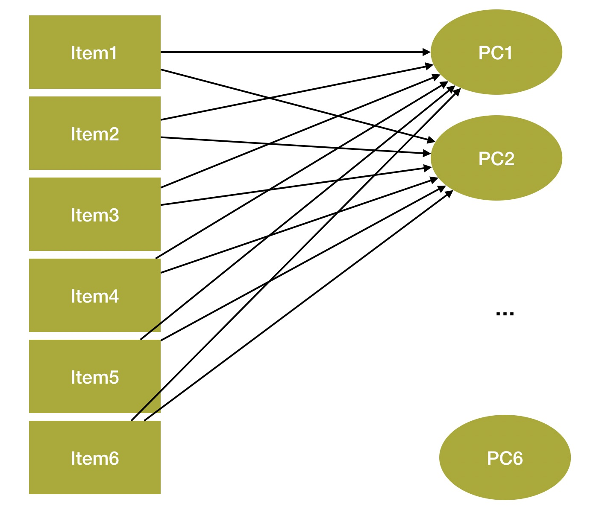
```

]  

.pull-right[
- Evenveel componenten als manifeste variabelen

- Alle manifeste variabelen laden op alle componenten

- Componenten zijn orthogonaal (= hangen niet samen) (maar niet-orthogonale rotatie is mogelijk)

- Geen meetfouten

- .SW-greenD[DATAGEDREVEN]
]       

---

## EFA model

.pull-left[

```{r, out.height = "75%", out.width="75%", eval = T, echo = F}
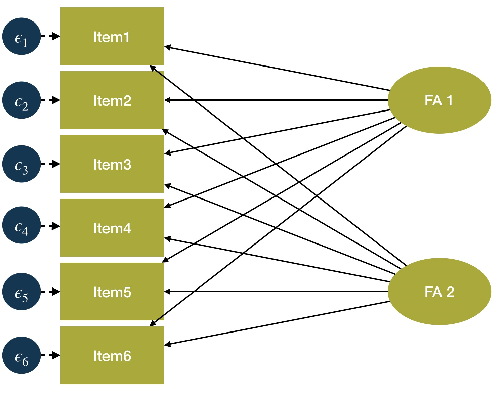
```

]

.pull-right[

- Minder factoren dan manifeste variabelen

- Alle manifeste variabelen laden op alle factoren

- Factoren zijn orthogonaal (maar niet-orthogonale rotatie is mogelijk)

- Wel meetfouten

- .SW-greenD[DATAGEDREVEN]
]

---

## CFA Model

.pull-left[

```{r, out.height = "75%", out.width="75%", eval = T, echo = F}
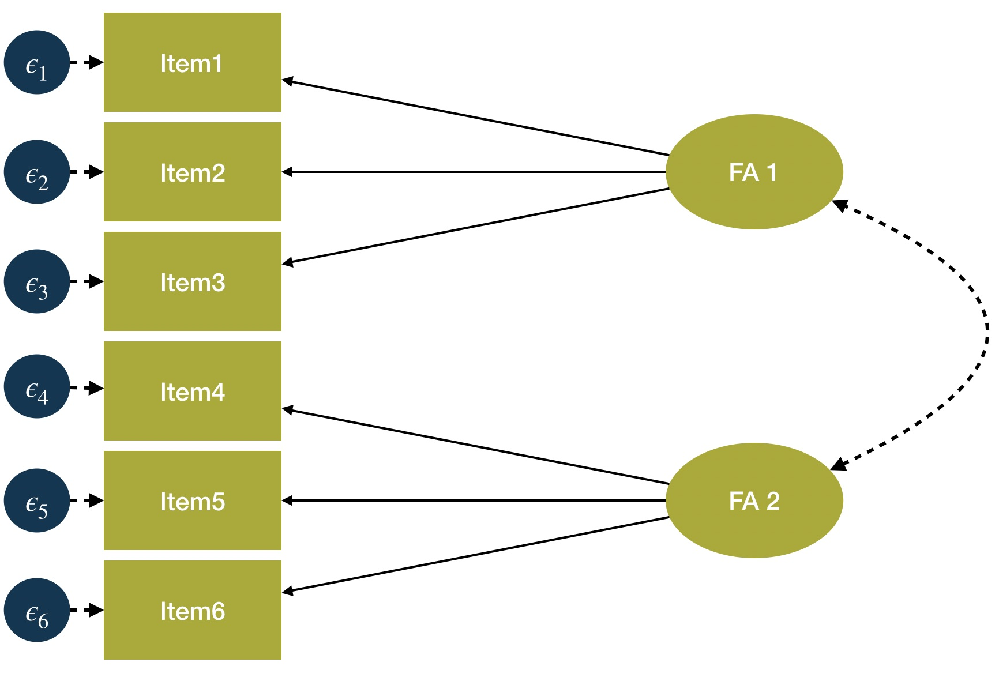
```

]

.pull-right[
- Minder factoren dan manifeste variabelen

- Niet alle manifeste variabelen laden op alle factoren

- Factoren kunnen correleren

- Wel meetfouten

- .SW-greenD[THEORIEGEDREVEN]
]

---

## CFA voorbeeld: Doorlichting.RData

```{r, out.height = "55%", out.width="55%", eval = T, echo = F}
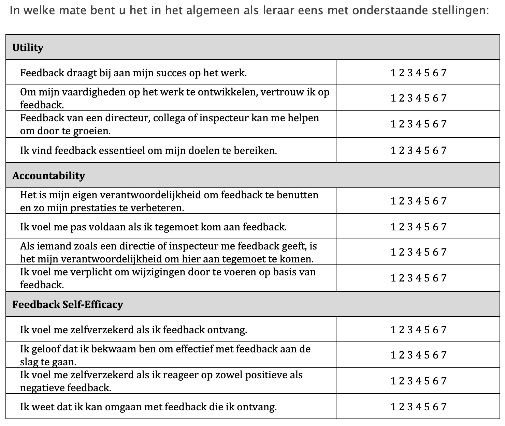
```

---

## CFA voorbeeld Doorlichting.RData - lavaan

```{r , echo = T, eval = F}
# Model definiëren

Feedback_CFA1 <- '
 Utility =~ FB_Utility1 + FB_Utility2 + FB_Utility3 + FB_Utility4
 Account =~ FB_Account1 + FB_Account2 + FB_Account3 + FB_Account4
 Selfeff =~ FB_Selfeff1 + FB_Selfeff2 + FB_Selfeff3 + FB_Selfeff4
'

# Model schatten

Fit_Feedback_CFA1 <- cfa(Feedback_CFA1, data = Doorlichting )

# Resultaten opvragen

summary(Fit_Feedback_CFA1, standardized = T, fit.measures = T)
```

```{r , echo = F, eval = T, size = "tiny"}
# Model definiëren

Feedback_CFA1 <- '
 Utility =~ FB_Utility1 + FB_Utility2 + FB_Utility3 + FB_Utility4
 Account =~ FB_Account1 + FB_Account2 + FB_Account3 + FB_Account4
 Selfeff =~ FB_Selfeff1 + FB_Selfeff2 + FB_Selfeff3 + FB_Selfeff4
'

# Model schatten

Fit_Feedback_CFA1 <- cfa(Feedback_CFA1, data = Doorlichting )
```

---

## CFA voorbeeld Doorlichting.RData - Model Fit

```{r}
fitMeasures(Fit_Feedback_CFA1, 
            c("npar","chisq","df","pvalue","cfi","rmsea"))
```

---

## CFA voorbeeld Doorlichting.RData - Parameterschattingen

```{r, out.height = "50%", out.width="50%", eval = T, echo = F}
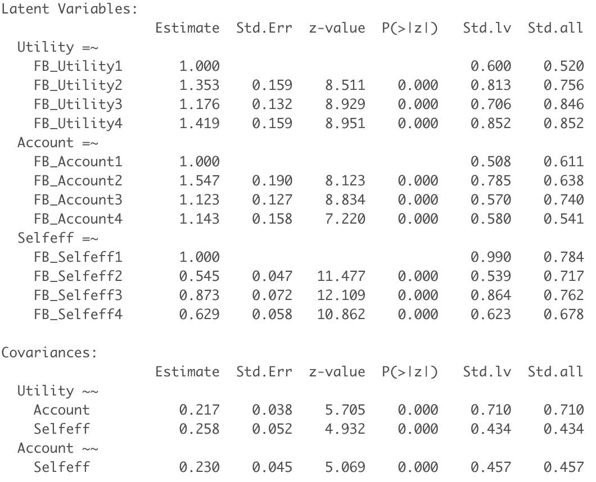
```

---
class: inverse-green, center, middle


# Modification Indices
*Wat als de fit toch niet 'je dat' is?*

---

## Wat als een model niet goed fit?

Het pad van .UA-red[zuiver theoriegedreven] verlaten! 

<br>

$\rightarrow$ Op zoek naar modelverbetering met minimale aanpassingen

$\rightarrow$ Nood aan informatie! 

---

## Modification indices

Als je een model 'tekent' zie je pijlen, maar sommige pijlen ontbreken:

$\rightarrow$ Samenhang tussen items

$\rightarrow$ Lading van een item op een tweede factor

<br>
> Modification indices geven per ontbrekende pijl (= verband / effect / lading) weer hoe sterk model fit zou verbeteren indien je die pijl zou opnemen

<br>
Die pijl die het model het **sterkst zou verbeteren** .UA-rood[EN] **inhoudelijk** steek houdt, kan worden toegevoegd aan het model

---

## Modification indices in R

Via het commando `modindices( )` 

<br>

Maak gebruik van het argument `sort = T` om ze te sorteren van hoog naar laag

<br>

Door dit nog een keer binnen een andere functie `head(..., 10)` te zetten, krijg je de 10 hoogste waarden zien

```{r, echo = T, eval = F, size = 'footnotesize', warning = F}
head(modindices(Fit_Feedback_CFA1, sort = T),10)
```
---

## CFA voorbeeld Doorlichting.RData - Modification indices

.pull-left[
.footnotesize[
```{r, echo=T, highlight=2}
head(modindices(Fit_Feedback_CFA1, sort = T),10)
```
]
]

.pull-right[

- Samenhang tussen `FB_Selfeff1` en `FB_Selfeff3` wordt gesuggereerd

- Chi-kwadraat zou met 30.23 eenheden dalen

- kolom `sepc.all` leert dat het een positieve samenhang zou zijn (0.65). Let op! Dat is een schatting.
]

---

## CFA voorbeeld Doorlichting.RData - lavaan (model 2)


```{r , echo = T, eval = F, size = "tiny"}
# Model definiëren

Feedback_CFA2 <- '
 Utility =~ FB_Utility1 + FB_Utility2 + FB_Utility3 + FB_Utility4
 Account =~ FB_Account1 + FB_Account2 + FB_Account3 + FB_Account4
 Selfeff =~ FB_Selfeff1 + FB_Selfeff2 + FB_Selfeff3 + FB_Selfeff4
 FB_Selfeff1 ~~ FB_Selfeff3
'

# Model schatten

Fit_Feedback_CFA2 <- cfa(Feedback_CFA2, data = Doorlichting )

# Resultaten opvragen

summary(Fit_Feedback_CFA2, standardized = T, fit.measures = T)
```

```{r , echo = F, eval = T}
# Model definiëren

Feedback_CFA2 <- '
 Utility =~ FB_Utility1 + FB_Utility2 + FB_Utility3 + FB_Utility4
 Account =~ FB_Account1 + FB_Account2 + FB_Account3 + FB_Account4
 Selfeff =~ FB_Selfeff1 + FB_Selfeff2 + FB_Selfeff3 + FB_Selfeff4
 FB_Selfeff1 ~~ FB_Selfeff3
'

# Model schatten

Fit_Feedback_CFA2 <- cfa(Feedback_CFA2, data = Doorlichting )

```

---

## CFA voorbeeld Doorlichting.RData - Fit measures (model 2)

```{r}
fitMeasures(Fit_Feedback_CFA2, 
            c("npar","chisq","df","pvalue","cfi","rmsea"))
```

---

## CFA voorbeeld PIRLS - Parameterschattingen (model 2)

```{r, out.height = "50%", out.width="50%", eval = T, echo = F}
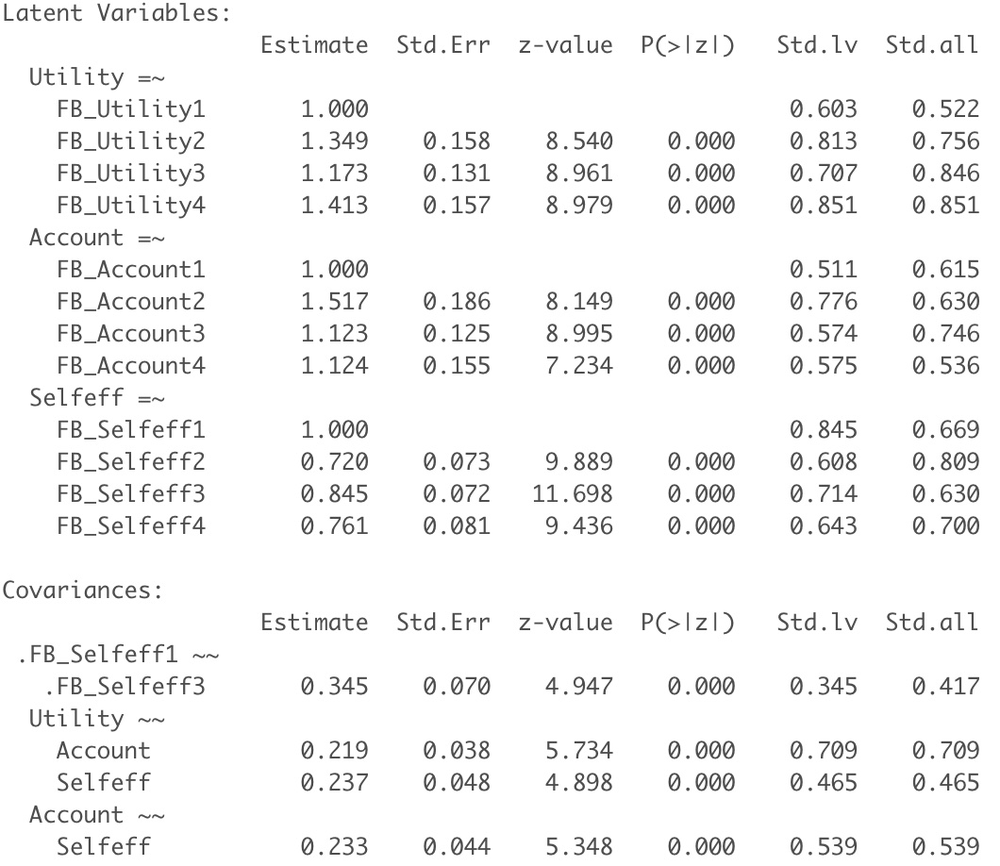
```

---
## Is het aangepaste model echt beter?


```{r, echo = T, comment = "", size="tiny"}
anova(Fit_Feedback_CFA1, Fit_Feedback_CFA2)
```

---
## Verdere werkwijze

Stapsgewijs te werk gaan:

1. Modification indices bekijken en 1 aanpassing maken;
2. Model opnieuw schatten met die aanpassing erbij;
3. Beter model?
3. Indien fit nog niet goed, opnieuw modification indices bekijken;
4. Eventueel nieuwe aanpassing toepassen;
5. Model fit bekijken van nieuwer model;
6. ...

---
class: inverse-green, middle, center

# Andere SEM modellen

---

## Regressiemodel met latente variabelen

```{r, out.height = "60%", out.width="60%", eval = T, echo = F}
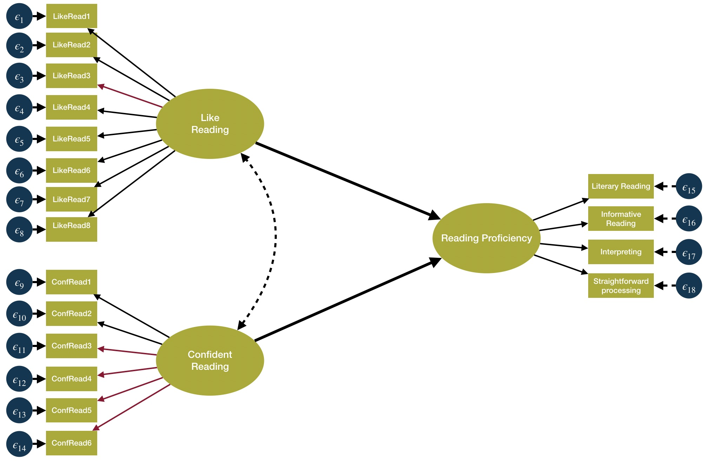
```

---
name: regressiemodel1

## Regressiemodel met latente variabelen

```{r, echo = F, eval = T}
load(here("C2", "Vlaanderen_1_2_3.RData"))

Vlaanderen_1_2_3$LikeRead1 <- Vlaanderen_1_2_3$ASBR06A
Vlaanderen_1_2_3$LikeRead2 <- Vlaanderen_1_2_3$ASBR06B
Vlaanderen_1_2_3$LikeRead3 <- Vlaanderen_1_2_3$ASBR06C
Vlaanderen_1_2_3$LikeRead4 <- Vlaanderen_1_2_3$ASBR06D
Vlaanderen_1_2_3$LikeRead5 <- Vlaanderen_1_2_3$ASBR06E
Vlaanderen_1_2_3$LikeRead6 <- Vlaanderen_1_2_3$ASBR06F
Vlaanderen_1_2_3$LikeRead7 <- Vlaanderen_1_2_3$ASBR06G
Vlaanderen_1_2_3$LikeRead8 <- Vlaanderen_1_2_3$ASBR06H
Vlaanderen_1_2_3$ConfRead1 <- Vlaanderen_1_2_3$ASBR07A
Vlaanderen_1_2_3$ConfRead2 <- Vlaanderen_1_2_3$ASBR07B
Vlaanderen_1_2_3$ConfRead3 <- Vlaanderen_1_2_3$ASBR07C
Vlaanderen_1_2_3$ConfRead4 <- Vlaanderen_1_2_3$ASBR07D
Vlaanderen_1_2_3$ConfRead5 <- Vlaanderen_1_2_3$ASBR07E
Vlaanderen_1_2_3$ConfRead6 <- Vlaanderen_1_2_3$ASBR07F

Regmodel_PIRLS_Latent <- '
        Reading_Proficiency =~  ASRLIT01 + ASRINF01 + ASRIIE01 + ASRRSI01
        LikeRead =~ LikeRead1 + LikeRead2 + LikeRead3 + LikeRead4 + LikeRead5 + LikeRead6 + LikeRead7 + LikeRead8
        ConfRead =~ ConfRead1 + ConfRead2 + ConfRead3 + ConfRead4 + ConfRead5 + ConfRead6
        Reading_Proficiency ~ LikeRead + ConfRead'

Vlaanderen_1_2_3$ASRLIT01 <- Vlaanderen_1_2_3$ASRLIT01/100
Vlaanderen_1_2_3$ASRINF01 <- Vlaanderen_1_2_3$ASRINF01/100
Vlaanderen_1_2_3$ASRIIE01 <- Vlaanderen_1_2_3$ASRIIE01/100
Vlaanderen_1_2_3$ASRRSI01 <- Vlaanderen_1_2_3$ASRRSI01/100

Fit_Regmodel <- sem(Regmodel_PIRLS_Latent, data = Vlaanderen_1_2_3)
```


```{r, echo = T, eval = F, message = F , warning = F, error = F, size = "tiny"}
Regmodel_PIRLS_Latent <- '
        Reading_Proficiency =~  ASRLIT01 + ASRINF01 + ASRIIE01 + ASRRSI01
        LikeRead =~ LikeRead1 + LikeRead2 + LikeRead3 + LikeRead4 + LikeRead5 + LikeRead6 + LikeRead7 + LikeRead8
        ConfRead =~ ConfRead1 + ConfRead2 + ConfRead3 + ConfRead4 + ConfRead5 + ConfRead6
        Reading_Proficiency ~ LikeRead + ConfRead'

Vlaanderen_1_2_3$ASRLIT01 <- Vlaanderen_1_2_3$ASRLIT01/100
Vlaanderen_1_2_3$ASRINF01 <- Vlaanderen_1_2_3$ASRINF01/100
Vlaanderen_1_2_3$ASRIIE01 <- Vlaanderen_1_2_3$ASRIIE01/100
Vlaanderen_1_2_3$ASRRSI01 <- Vlaanderen_1_2_3$ASRRSI01/100

Fit_Regmodel <- sem(Regmodel_PIRLS_Latent, data = Vlaanderen_1_2_3)

summary(Fit_Regmodel, standardized = T, fit.measures = T)
```

.footnote[Op de achtergrond zijn variabelenamen veranderd [<i> zie appendix1</i>](#appendix1)]
---
## Regressiemodel met latente variabelen

```{r, out.height = "45%", out.width="45%", eval = T, echo = F}
fitMeasures(Fit_Regmodel, 
            c("npar","chisq","df","pvalue","cfi","rmsea"))
```


---

## Regressiemodel met latente variabelen

```{r, out.height = "45%", out.width="45%", eval = T, echo = F}
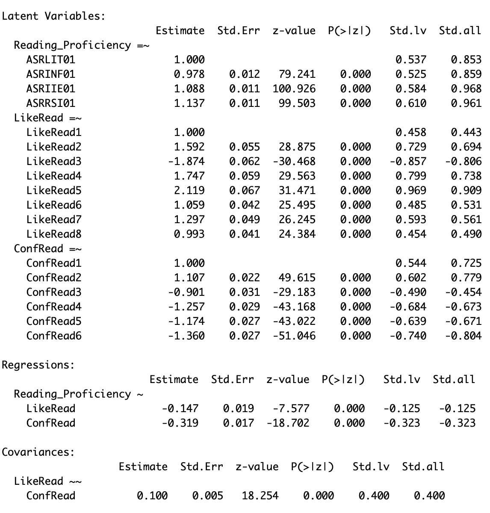
```

---
class: inverse-red, middle, center

# Time to pRactice!

**Oefeningen en respons** terug te vinden op BB

---
class: inverse-blue, middle, center

# Appendix

---
name: appendix1
## Code op de achtergrond om variabelenamen uit PIRLS te verandere


```{r, echo = T , eval = F}

Vlaanderen_1_2_3$LikeRead1 <- Vlaanderen_1_2_3$ASBR06A
Vlaanderen_1_2_3$LikeRead2 <- Vlaanderen_1_2_3$ASBR06B
Vlaanderen_1_2_3$LikeRead3 <- Vlaanderen_1_2_3$ASBR06C
Vlaanderen_1_2_3$LikeRead4 <- Vlaanderen_1_2_3$ASBR06D
Vlaanderen_1_2_3$LikeRead5 <- Vlaanderen_1_2_3$ASBR06E
Vlaanderen_1_2_3$LikeRead6 <- Vlaanderen_1_2_3$ASBR06F
Vlaanderen_1_2_3$LikeRead7 <- Vlaanderen_1_2_3$ASBR06G
Vlaanderen_1_2_3$LikeRead8 <- Vlaanderen_1_2_3$ASBR06H
Vlaanderen_1_2_3$ConfRead1 <- Vlaanderen_1_2_3$ASBR07A
Vlaanderen_1_2_3$ConfRead2 <- Vlaanderen_1_2_3$ASBR07B
Vlaanderen_1_2_3$ConfRead3 <- Vlaanderen_1_2_3$ASBR07C
Vlaanderen_1_2_3$ConfRead4 <- Vlaanderen_1_2_3$ASBR07D
Vlaanderen_1_2_3$ConfRead5 <- Vlaanderen_1_2_3$ASBR07E
Vlaanderen_1_2_3$ConfRead6 <- Vlaanderen_1_2_3$ASBR07F

```

.footnote[ [<i> Terug naar slide met code</i>](#regressiemodel1)]
