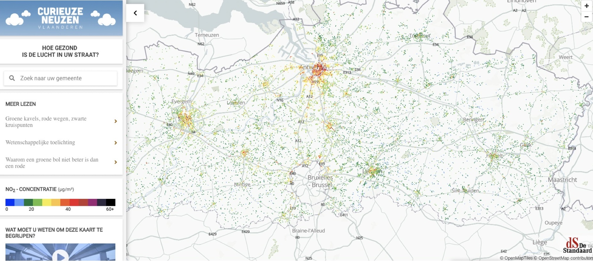
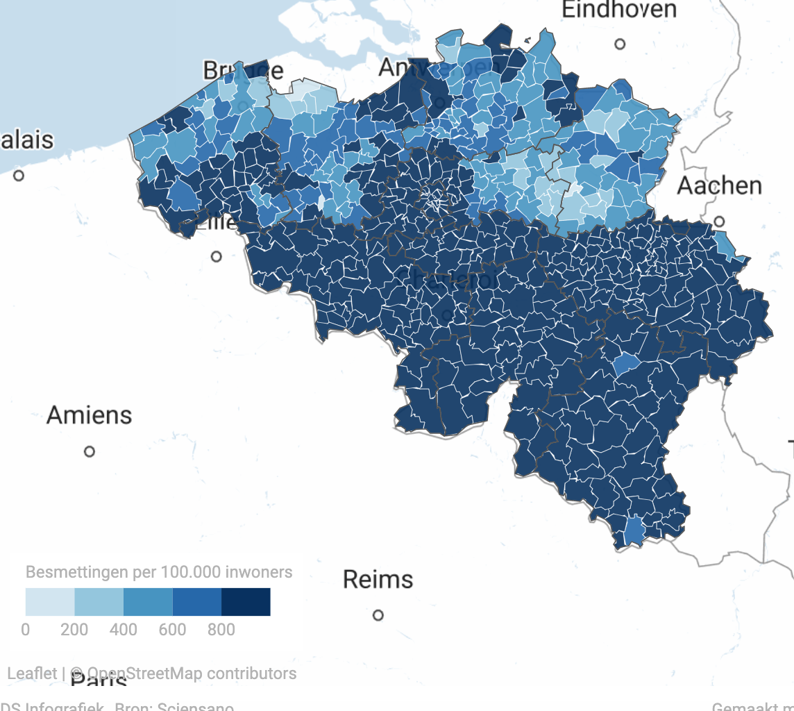
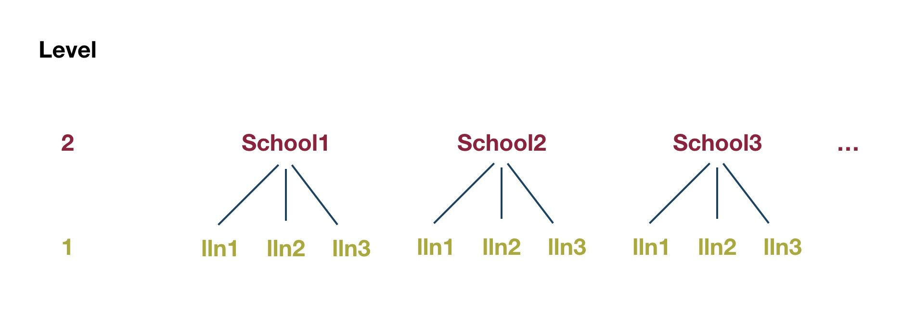
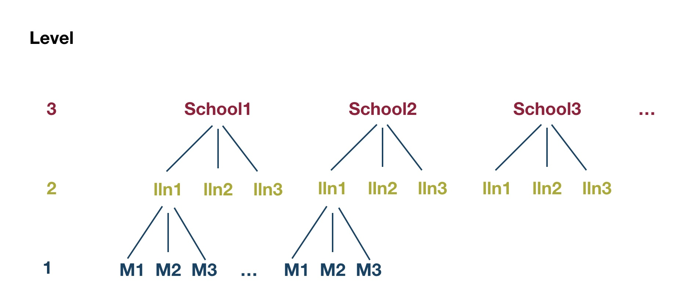
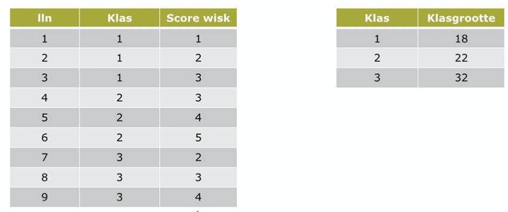
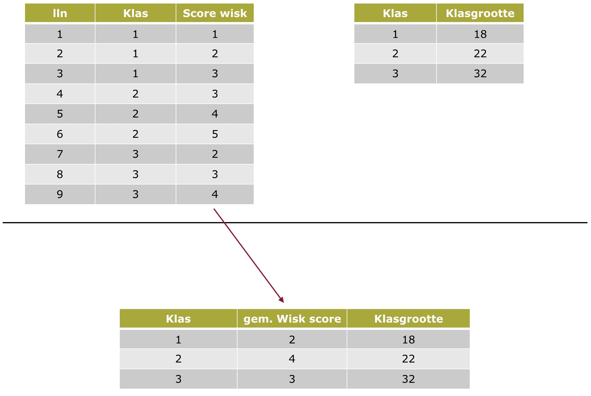
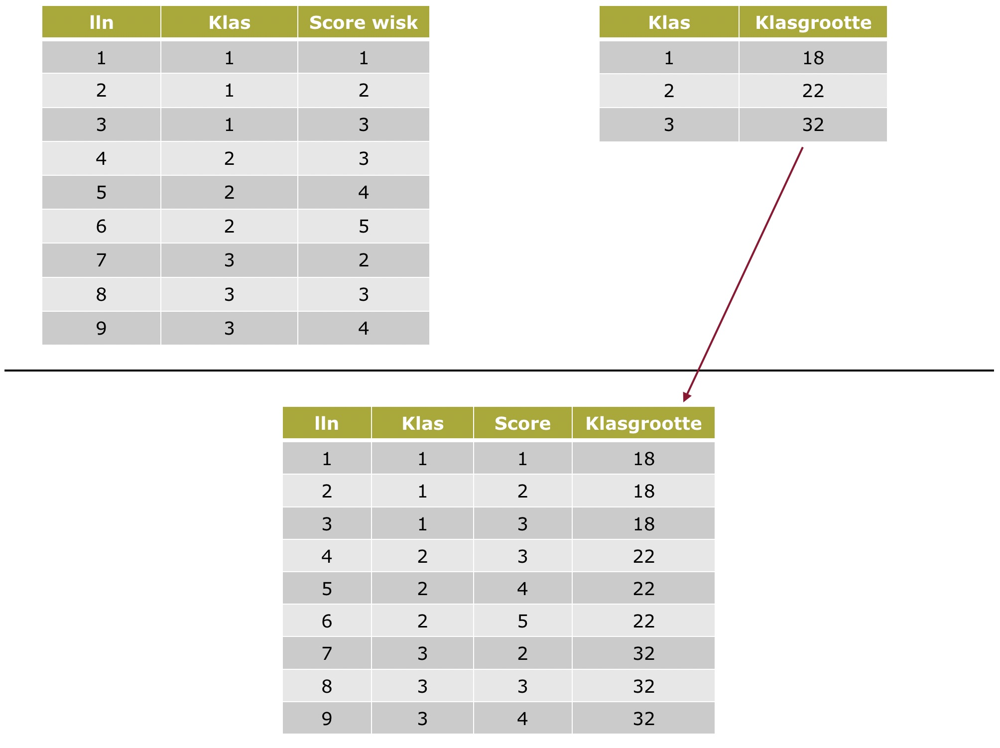
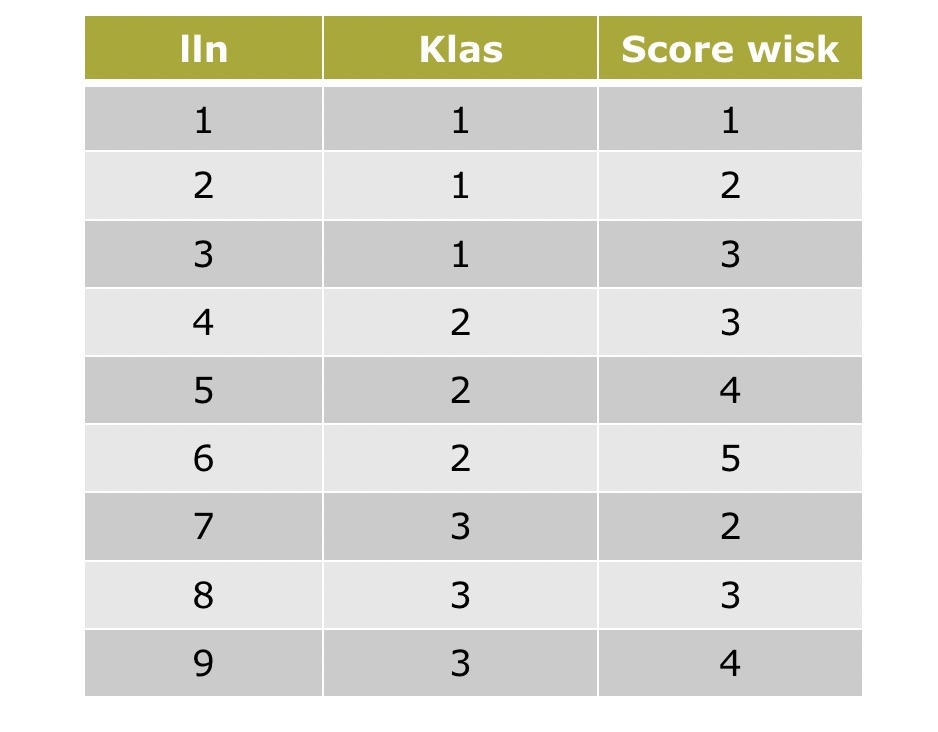
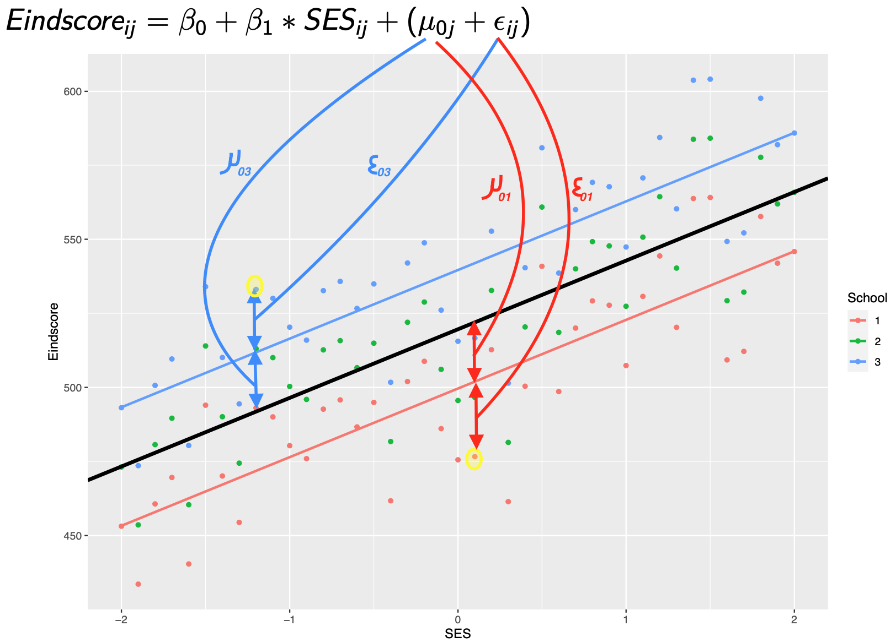

class: title-slide, center, middle

<style>
.center2 {
  margin: 0;
  position: absolute;
  top: 50%;
  left: 50%;
  -ms-transform: translate(-50%, -50%);
  transform: translate(-50%, -50%);
}
</style>

```{r ,warning=F,message=F,echo=F}
library(here)
library(dplyr)
library(knitr)
library(tidyr)
library(purrr)
library(ggplot2)
library(patchwork)
load(here("C3", "Vlaanderen_1_2_3.RData"))
source(here("C3","OLP2 Functies.R"))
library(car)
Vlaanderen_1_2_3$Onderpresteren <- recode(Vlaanderen_1_2_3$ASRIBM01,'1=1;2=1;3=0;4=0;5=0')
Vlaanderen_1_2_3$Gender <- recode(Vlaanderen_1_2_3$ASBG01, '1 = "Girls"; 2 = "Boys"') 
Vlaanderen_1_2_3$Ouders_GraagLezenZ <- scale(Vlaanderen_1_2_3$ASBHPLR) 
library(lmerTest)
library(lme4)
```

```{r setup, echo = FALSE}
knitr::opts_chunk$set(fig.retina = 3, warning = FALSE, message = FALSE)
```

```{css echo=FALSE}
.right-column{
  padding-top: 0;
}

.remark-code, .remark-inline-code { font-family: 'Source Code Pro', 'Lucida Console', Monaco, monospace;
                                    font-size: 75%;
                                  }


```


<div class="my-logo-left">  </div>


# GKN - Contactmoment 3
.font160[
.SW-greenD[Multilevel Analyse (Deel 1)] 
]
Sven De Maeyer & Bea Mertens

.font80[
.UA-red[
18/11/2021
]
]

---
class: inverse-green, center, middle

# Opwarmertjes

*Multilevel is Everywhere...*

---

## Geografisch opwarmertje...

```{r, out.height = "75%", out.width="75%", eval = T, echo = F}

```

---

## Virologisch opwarmertje...

```{r, out.height = "75%", out.width="75%", eval = T, echo = F}

```

---

## Sportief opwarmertje...

```{r, out.height = "75%", out.width="75%", eval = T, echo = F}

```

---

## OOW opwarmertje 1...

*.UA-red[Welke factoren beïnvloeden de ervaren nood aan opleiding bij kenniswerkers?]*

<br>

Data:

- 289 kenniswerkers

- 33 bedrijven

---

## OOW opwarmertje 2...

*.UA-red[Hoe sterk is het effect van sociale achtergrond op scores die leerlingen halen voor begrijpend lezen in het PIRLS onderzoek?]*

<br> 

Data:

- +/- 319 000 4de jaars

- +/-  12 000 scholen

- 50 landen

---

## OOW opwarmertje 3...

*.UA-red[Hoe evolueert de perceptie van teamleden aangaande team reflexiviteit doorheen de tijd?]*

<br> 

Data:

- Periode van 10 weken

- twee-dagelijks zeer korte vragenlijst

- 11 teams

- 6 leden per team

---
class: inverse-green, center, middle

# Hiërarchie

*What's in the word ... ?*

---

## Multi...levels...

Data in voorbeelden duiden op .UA-red[genestheid]    

Anders gezegd, er zit .UA-red[hiërarchie] in de data

<br>

Voorbeelden:

- mensen wonend (~ genest in) in straten van wijken van ... 

- kenniswerkers tewerkgesteld (~ genest in) in bedrijven

---

## Levels... (2 levels)

```{r, out.height = "75%", out.width="75%", eval = T, echo = F}

```


---
## Levels... (3 levels)

```{r, out.height = "75%", out.width="75%", eval = T, echo = F}

```

---

## Soorten hiërarchiën

**2 soorten hiërarchieën**:  


.SW-greenD[Natuurlijke]

- Lln in klassen (in scholen, in landen)
- Werknemers in bedrijven
- Meetpunten in straten, die deel uitmaken van buurten, steden, provincies, … (zie Curieuzeneuzen)   


Door .SW-greenD[onderzoeksdesign]

- Longitudinaal 
- Bloksteekproef
- Experimenteel 

---
class: inverse-green, center, middle

# Hiërarchie...  So what?

*Het doet er wel degelijk toe!!*

---
class: inverse-blue

## Probleem 1. 
##Hiërarchie in de onderzoeksvraag

**Praktisch:**

Hoe ga je onderzoeksvragen analyseren indien de vragen kenmerken van het ene niveau linken aan kenmerken van het andere niveau?

<br>

**Voorbeeld:**         

> Heeft klasgrootte een impact op leerlingenprestaties? (een variabele op klasniveau en een variabele op leerlingniveau)

---

## Oplossing? 

```{r, out.height = "75%", out.width="75%", eval = T, echo = F}

```

---

## Oude oplossing 1: AGGREGEREN

```{r, out.height = "70%", out.width="70%", eval = T, echo = F}

```

---
## Ecological fallacy  (~Aggregation bias!)

.UA-red[= ‘the invalid transfer of aggregate results to individuals’]

<br>

.SW-greenD[Robinson studie (1950) (data van 1930)]

Correlatie tussen ‘Illiteracy’ and ‘Nativity’ (foreign-born vs. rest):

- at state level = -0.53
- at individual level = 0.12

---

## Oude oplossing 2: DESAGGREGEREN

```{r, out.height = "70%", out.width="70%", eval = T, echo = F}

```

---

## Atomistic fallacy

.UA-red[= ‘the invalid transfer of individual results to aggregates’]

<br>

- *r* IQ en Prestaties op leerlingniveau = 0.53     

- Wil niet PER DEFINITIE zeggen dat scholen met een hoger gemiddeld IQ ook gemiddeld hoger gaan scoren op gemiddelde prestatie

---
class: inverse-blue

## Probleem 2. 
## Hiërarchie heeft statistische gevolgen

**Statistisch
: ** 
Hiërarchie negeren heeft invloed op schattingen 

<br>

**Voorbeeld:**       

> In PIRLS onderzoek, verband tussen SES en score op begrijpend lezen onderzoeken (beide variabelen op leerlingniveau)}

<br>
Nog steeds is hiërarchie een probleem! Schattingen zijn niet ok...
---
## Intuïtief

> “Everything is related to everything else, but near things are more related than distant things.” (Tobler, 1970)

<br> 

- 2 Studenten uit zelfde school lijken meer op elkaar dan 2 willekeurige leerlingen uit verschillende scholen

- Medewerkers van een bepaald bedrijf ...

- Metingen van zelfde persoon op verschillende tijdstippen  ...

<br> 

$\Leftrightarrow$ .UA-red[Assumptie bij regressieanalyse: waarnemingen zijn onafhankelijk van elkaar]

---
## Een voorbeeld met data (1)

.pull-left[
```{r, out.height = "70%", out.width="70%", eval = T, echo = F}

```
]

.pull-right[
*Hoe groot is de variantie in wiskundescores?*
]

---

## Een voorbeeld met data (2)

.pull-left[
```{r, out.height = "70%", out.width="70%", eval = T, echo = F}

```
]
.pull-right[
*Hoe groot is de variantie in wiskundescores?*

<br>

.SW-greenD[Simpele benadering] (zonder rekening te houden met hiërarchie)

.footnotesize[
```{r, echo = T, size = "tiny", comment=""}
var(c(1,2,3,3,4,5,2,3,4))
```
]
]

---
## Een voorbeeld met data (3)

.pull-left[
```{r, out.height = "70%", out.width="70%", eval = T, echo = F}

```
]

.pull-right[
*Hoe groot is de variantie in wiskundescores?*

<br>

.SW-greenD[Rekening houdend met hiërarchie]

.footnotesize[
```{r, echo = T, size = "tiny", comment=""}
# Variantie tussen klassen
var(c(2,4,3))

# Variantie binnen klassen
(var(c(1,2,3)) + var(c(3,4,5)) + var(c(2,3,4))) / 3

# Totale variantie:

var(c(1,2,3)) + (var(c(1,2,3)) + var(c(3,4,5)) + var(c(2,3,4))) / 3

```
]
]

---

## Een voorbeeld met data (4)

.pull-left[
```{r, out.height = "70%", out.width="70%", eval = T, echo = F}

```
]

.pull-right[*Hoe groot is de variantie in wiskundescores?*

- Hiërarchie genegeerd: .UA-red[1.5]
<br>
<br>
- Hiërarchie in rekening genomen: .UA-red[2]
]
---
## Variantie wordt onderschat & p-waarde te laag geschat!

```{r, echo = F, fig.height = 6, fig.width = 18, fig.align="center", message=FALSE}
n         <- 200
Variantie <- seq(from = 1, to = 3, by = 0.1)
St_fout   <- Variantie/sqrt(n)
Effect    <- 0.15
z_waarden <- Effect/St_fout
p_waarden <- 1-pnorm(z_waarden)
D         <- data.frame(Variantie,St_fout,z_waarden,p_waarden)

p1 <- ggplot(D, aes(Variantie,St_fout)) + geom_smooth(method = "lm", se = FALSE) + ggtitle("Effect = 0.15 ; n = 200") + theme(axis.title = element_text(face="bold"), plot.title = element_text(face="italic"))
p2 <- ggplot(D, aes(St_fout,p_waarden)) + geom_smooth(method = "lm", se = FALSE) + ggtitle("Effect = 0.15 ; n = 200")+ theme(axis.title = element_text(face="bold"), plot.title = element_text(face="italic"))
p3 <- ggplot(D, aes(Variantie,p_waarden)) + geom_smooth(method = "lm", se = FALSE) + ggtitle("Effect = 0.15 ; n = 200")+ theme(axis.title = element_text(face="bold"), plot.title = element_text(face="italic"))

p1 + p2 + p3 
```

---
class: inverse-green, center, middle

# Multilevel model

*Bring on the power!*

---

## Regressieanalyse

.pull-left[
$Eindscore_{i} = \beta_0 + \beta_1 * SES_{i} + \epsilon_{i}$
]

.pull-right[
```{r, echo = F,fig.width = 8,fig.align="center", message=F}
SES <- seq(from = -2, to = 2, by = 0.1)

Score <- 500 + 25*SES 

set.seed(1975)
Eindscore <- Score + rnorm(41, 0 , 20)
Eindscore1 <- Eindscore
Eindscore2 <- Eindscore + 20
Eindscore3 <- Eindscore + 40

School <- as.factor(c(rep(1,41),rep(2,41),rep(3,41)))
SES <- rep(SES,3)
Eindscore <- c(Eindscore1,Eindscore2,Eindscore3)

library(ggplot2)
D <- data.frame(SES , Eindscore, School)
P <- ggplot(D, aes(SES,Eindscore)) + geom_point(color = 'red')
P + geom_smooth(method = "lm", se = F)
```
]
---

## Regressieanalyse

.pull-left[
$Eindscore_{i} = \beta_0 + \beta_1 * SES_{i} + \epsilon_{i}$
]

.pull-right[
```{r, echo = F,fig.width = 8,fig.align="center"}
cbPalette <- c("#999999", "#E69F00", "#56B4E9", "#009E73", "#F0E442", "#0072B2", "#D55E00", "#CC79A7")


P <- ggplot(D, aes(SES,Eindscore,colour = School)) + geom_point()
P + geom_abline(intercept = 519.624, slope = 23.165,size = 1.5) 

```
]

---
## 3 regressiemodellen

.pull-left[
School 1:
$Eindscore_{i} = \beta_0 + \beta_1 * SES_{i} + (\epsilon_{i})$

School 2:
$Eindscore_{i} = \beta_0 + \beta_1 * SES_{i} + (\epsilon_{i})$

School 3:
$Eindscore_{i} = \beta_0 + \beta_1 * SES_{i} + (\epsilon_{i})$
]
.pull-right[
```{r, echo = F,fig.width=8,fig.align="center", message=F}
P <- ggplot(D, aes(SES,Eindscore,colour = School)) + geom_point()
P + geom_smooth(method = "lm", se = F)
```
]

---

## Multilevel model

.pull-left[
$Eindscore_{ij} = \beta_0 + \beta_1 * SES_{ij} + (\mu_{0j} + \epsilon_{ij})$
]

.pull-right[
```{r, echo = F,out.height="70%",fig.align="center", message=F}
P <- ggplot(D, aes(SES,Eindscore,colour = School)) + geom_point()
P + geom_smooth(method = "lm", se = F)+ geom_abline(intercept = 519.624, slope = 23.165,size = 1.5) 
```
]

---

## Multilevel model - Random Intercepts

```{r, out.height = "70%", out.width="70%", eval = T, echo = F}

```

---

## Multilevel model - Random Intercepts

$Eindscore_{ij} = \beta_0 + \beta_1 * SES_{ij} + (\mu_{0j} + \epsilon_{ij})$

<br>

**3 scholen**, dus **3 verschillende 	$\mu_{0j}$'s**:


- $\mu_{01} \approx -19.39$
- $\mu_{02} \approx 0$
- $\mu_{03} \approx 19.39$


**Variantie tussen scholen** (berekend):


$\sigma_{\mu_{0j}}^2 = \frac{(\mu_{01}^2 + \mu_{02}^2 + \mu_{03}^2)}{3} \approx 250.56$

---
## Multilevel model - Random Intercepts

$Eindscore_{ij} = \beta_0 + \beta_1 * SES_{ij} + (\mu_{0j} + \epsilon_{ij})$


**123 leerlingen**, dus **123 verschillende	$\epsilon_{0ij}$'s**:


**Variantie tussen leerlingen** (berekend) = 


$\sigma_{\epsilon_{0ij}}^2 = \frac{(\epsilon_{011}^2 + \epsilon_{012}^2 + ...)}{123} \approx 327.39$

---

## ICC

*.UA-red[Hoe groot is de impact van scholen?]*

<br>

Uitgedrukt in '% variantie'

<br>

$ICC = \frac{\sigma_{\mu_{0j}}^2}{\sigma_{\mu_{0j}}^2 + \sigma_{\epsilon_{0ij}}^2}=\frac{var_{scholen}}{var_{scholen} + var_{lln}} = \frac{250.56}{250.56 + 327.39} = 0.43$

.footnote[ICC = Intraclass Correlation]
---

## Multilevel model - Random Intercepts

Wat wordt geschat (ipv berekend zoals hierboven):

- .SW-greenD[Fixed effects] = het model overheen alle eenheden

- .SW-greenD[Random effects] = verschillende varianties

<br>

In ons voorbeeld

- Fixed effects: Intercept + Slope (SES)

- Random effects: (1) Variantie tussen scholen en (2) variantie tussen leerlingen in scholen

---
class: inverse-green, center, middle

# Multilevel analyse in R (lme4)

*Let the fun begin...*

---

## Pakketten in R

Er bestaan verschillende pakketten in R om multilevel analyses uit te voeren

<br>

Wij hanteren .UA-red[`lme4`] en aanvullend het pakket .UA-red[`lmerTest` ]

```{r, echo = T , eval = F, warning = F , message = F}
install.packages('lme4', dependencies = T)
install.packages('lmerTest', dependencies = T)
library(lme4)
library(lmerTest)
```

---

## Nulmodel definiëren

.SW-greenD[Model zonder enige voorspellers.]

<br>

**Doel**
    
*Schatten van de 'onconditionele' varianties op de verschillende onderscheiden niveaus (levels)*

<br>

Enkel een overall gemiddelde en varianties worden geschat...

.footnote[
*We zullen straks werken met een PIRLS voorbeeld over leesvaardigheid. *
```{r}
Vlaanderen_1_2_3$Leesvaardigheid <- Vlaanderen_1_2_3$ASRREA01
```
]

---

## Nulmodel definiëren (voorbeeld in Pirls)

.pull-left[
```{r, size = "tiny", echo=T, eval = F, comment=""}
PIRLS_Model0 <- lmer(
  Leesvaardigheid ~ 1 + (1|IDSCHOOL), 
  data = Vlaanderen_1_2_3,
  REML = F)

summary(PIRLS_Model0)

# ICC 
587.4/(587.4+3095.2)
```
]

.pull-right[
.footnotesize[
```{r, size = "tiny", echo=F, comment=""}
PIRLS_Model0 <- lmer(
  Leesvaardigheid ~ 1 + (1|IDSCHOOL), 
  data = Vlaanderen_1_2_3,
  REML = F)

summary(PIRLS_Model0)

# ICC 
587.4/(587.4+3095.2)
```
]
]
---
## Nulmodel met 3 levels

.pull-left[
Ook variantie tussen klassen?

```{r, echo = T, eval = F, size = "tiny", comment = ""}
PIRLS_Model1 <- lmer(
  Leesvaardigheid ~ 1 + (1|IDSCHOOL) + (1|IDCLASS), 
  data = Vlaanderen_1_2_3,
  REML = F)

summary(PIRLS_Model1)

# ICC klasniveau
166.1/(166.1 + 490.4 + 3016.6)
# ICC schoolniveau
490.4/(166.1 + 490.4 + 3016.6)
```
]

.pull-right[
.footnotesize[
```{r, echo = F, eval = T, size = "tiny",comment = ""}
PIRLS_Model1 <- lmer(Leesvaardigheid ~ 1 + (1|IDSCHOOL) + (1|IDCLASS), 
                     data = Vlaanderen_1_2_3,
                     REML = F)
summary(PIRLS_Model1)

# ICC klasniveau
166.1/(166.1 + 490.4 + 3016.6)
# ICC schoolniveau
490.4/(166.1 + 490.4 + 3016.6)
```
]
]

---

## Welk nulmodel best?

Opnieuw hanteren we het commando .UA-red[`anova( )`]     

<br> 

Let op! Modellen moeten **op dezelfde data geschat** worden  
<br>
$\rightarrow$ `na.omit()` indien nodig

```{r, size = "tiny", echo = T, comment=""}
anova(PIRLS_Model0 , PIRLS_Model1)
```

---

## Significantietoetsen voor variantieschattingen

```{r, size = "tiny", echo = T, comment=""}
rand(PIRLS_Model1)
```

<br>

logLik is significant lager voor modellen waarin ofwel variantie tussen scholen of variantie tussen klassen verwijderd worden

<br>

$\rightarrow$ Beide varianties behouden in het model

---

## Voorspellers toevoegen

```{r}
Vlaanderen_1_2_3$Gender <- recode(
  Vlaanderen_1_2_3$ASBG01, 
  '1 = "Girls"; 2 = "Boys"'
  ) 

Vlaanderen_1_2_3$Ouders_GraagLezenZ <- scale(Vlaanderen_1_2_3$ASBHPLR) 
```


```{r, echo = T, size = "tiny"}
PIRLS_ModelRI <- lmer(
  Leesvaardigheid ~ 1 + Gender + Ouders_GraagLezenZ + 
    (1|IDSCHOOL) + (1|IDCLASS), 
  data = Vlaanderen_1_2_3, 
  REML = F)
```

---
## Voorspellers toevoegen
.footnotesize[
```{r, echo = F, size = "tiny", comment=""}
summary(PIRLS_ModelRI)
```
]

---
## Conditionele varianties vs. onconditionele varianties
<br>

Wat valt op als je naar de varianties kijkt?

<br>
<br>
<br>

|                      | Nulmodel (oncond.) | ModelRI (cond.) |
|----------------------|:-----------------------:|:---------------------:|
| Variantie klassen    |          166.1          |         151.2         |
| Variantie scholen    |          490.4          |         420.8         |
| Variantie leerlingen |          3016.6         |         2871.3        |

---
class: inverse-blue

## Blik op de toekomst

Mogelijkheid tot **peerfeedback op tussentijdse versie van de paper**!

Info volgt, maar voor nu alvast:

- deadline indienen paper° **zondag 12 december**

- peerfeedback via **Comproved** (maandag 13 december tot zondag 19 december)

- bespreking tijdens C6 (23 december)

.footnote[
° *Tussentijdse versie = methodologieluik + OV1 + OV2*
]
---
class: inverse-red, middle, center

# Time to pRactice!

**Oefeningen en respons** terug te vinden op BB
