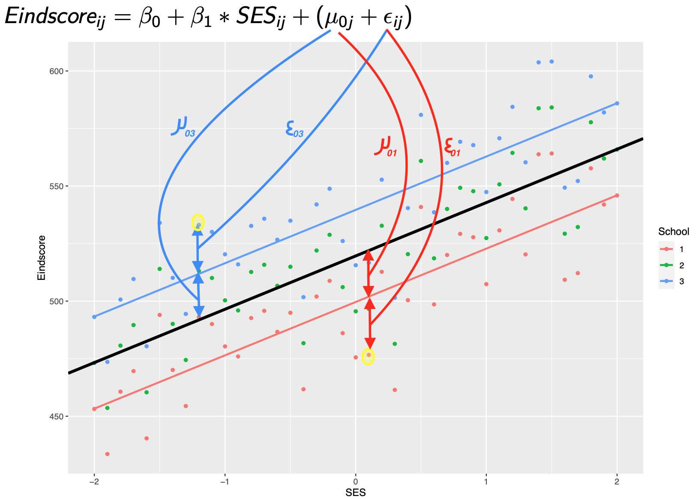

class: title-slide, center, middle

<style>
.center2 {
  margin: 0;
  position: absolute;
  top: 50%;
  left: 50%;
  -ms-transform: translate(-50%, -50%);
  transform: translate(-50%, -50%);
}
</style>

```{r ,warning=F,message=F,echo=F}
library(here)
library(dplyr)
library(knitr)
library(tidyr)
library(purrr)
library(ggplot2)
library(patchwork)
load(here("C4", "Vlaanderen_1_2_3.RData"))
source(here("C4","OLP2 Functies.R"))
library(car)
Vlaanderen_1_2_3$Onderpresteren <- recode(Vlaanderen_1_2_3$ASRIBM01,'1=1;2=1;3=0;4=0;5=0')
Vlaanderen_1_2_3$Gender <- recode(Vlaanderen_1_2_3$ASBG01, '1 = "Girls"; 2 = "Boys"') 
Vlaanderen_1_2_3$Ouders_GraagLezenZ <- scale(Vlaanderen_1_2_3$ASBHPLR) 
library(lmerTest)
library(lme4)
library(sjPlot)
```

```{r setup, echo = FALSE}
knitr::opts_chunk$set(fig.retina = 3, warning = FALSE, message = FALSE)
```

```{css echo=FALSE}
.right-column{
  padding-top: 0;
}

.remark-code, .remark-inline-code { font-family: 'Source Code Pro', 'Lucida Console', Monaco, monospace;
                                    font-size: 75%;
                                  }


```


<div class="my-logo-left">  </div>


# GKN - Contactmoment 4
.font160[
.SW-greenD[Multilevel Analyse (Deel 2)] 
]
Sven De Maeyer & Bea Mertens

.font80[
.UA-red[
25/11/2021
]
]

---
class: inverse-green, center, middle

# Random Intercepts

*Herhaling...*

---

## Multilevel structuur...

.pull-left[
```{r, out.height = "75%", out.width="75%", eval = T, echo = F}

```
]
.pull-right[
```{r, out.height = "75%", out.width="75%", eval = T, echo = F}

```
]


---
## Waarom multilevel?

```{r, out.height = "30%", out.width="30%", eval = T, echo = F, fig.align="center"}

```

---
## Nulmodel

```{r}
Vlaanderen_1_2_3$Leesvaardigheid  <- Vlaanderen_1_2_3$ASRREA01
Vlaanderen_1_2_3$LeesvaardigheidZ <- scale(Vlaanderen_1_2_3$ASRREA01)
```

**Model zonder enige voorspellers.** OOK *(Onconditioneel model)*    
<br>

Rol van **School** en **Klas** bij leesscores in PIRLS?

.footnotesize[
```{r, echo = T, size = "tiny"}
PIRLS_Model0 <- lmer(Leesvaardigheid ~ 1 + (1|IDSCHOOL) + (1|IDCLASS), 
                     data = Vlaanderen_1_2_3,
                     REML = F)
```
]
---
## Nulmodel: resultaten
.footnotesize[
```{r, echo = T, size = "tiny", comment=""}
summary(PIRLS_Model0)
```
]

.UA-red[**Hoe groot is de impact van klassen/scholen?**]

---
## Nulmodel: ICC

Effectgrootte, uitgedrukt in %

```{r, echo=T, comment="", size="tiny"}
# ICC klasniveau
166.1/(166.1 + 490.4 + 3016.6)
# ICC schoolniveau
490.4/(166.1 + 490.4 + 3016.6)
```

---
## Random intercept model

**Model met voorspellers.** OF **Conditioneel model**  

<br>

Rol van **School** en **Klas** bij leesscores in PIRLS,    

na controle voor **Ouders_GraagLezenZ** en **Gender**?

.footnotesize[
```{r, echo = T, size = "tiny"}
PIRLS_ModelRI <- lmer(
  Leesvaardigheid ~ 1 + Gender + Ouders_GraagLezenZ + 
                     (1|IDSCHOOL) + (1|IDCLASS), 
  data = Vlaanderen_1_2_3, REML = F)
```
]

---
## Random intercept model: formule
```{r, out.height = "65%", out.width="65%", eval = T, echo = F}

```

---
## Random intercept model: resultaten
.footnotesize[
```{r, size="tiny", comment=""}
summary(PIRLS_ModelRI)
```
]
---
## Random intercept model: resultaten

```{r, comment = ""}
# ICC klasniveau
151.2/(151.2 + 420.8 + 2871.3)
# ICC schoolniveau
420.8/(151.2 + 420.8 + 2871.3)
```

---
## Random intercept model: resultaten (via tab_model)

.pull-left[
```{r, echo = T, eval = FALSE}
library(sjPlot)
tab_model(PIRLS_ModelRI, 
          show.se = TRUE,
          show.ci = FALSE,
          show.icc = FALSE, 
          show.aic = FALSE, 
          show.r2 = FALSE)
```
]
.pull-right[
```{r, echo = F}
library(sjPlot)
tab_model(PIRLS_ModelRI, 
          show.se = TRUE,
          show.ci = FALSE,
          show.icc = FALSE, 
          show.aic = FALSE, 
          show.r2 = FALSE)
```
]
---
## Random intercept model: significantie random effecten?
Via de functie `confint` uit pakket `lme4` kan je betrouwbaarheidsintervallen voor de random effecten opvragen

<br>

```{r, echo=T, comment="", size="tiny"}
# Eerst via VarCorr( ) enkel de varianties uit de output opnieuw opvragen...
VarCorr(PIRLS_ModelRI)

# Vervolgens via confint( ) de CI's berekenen
ModelRI_CI <- confint(PIRLS_ModelRI, level =.95)
ModelRI_CI
```

---
## Random intercept model: visualisatie (1)
.pull-left[
In OLP staat functie `xyplot( )` uit het pakket `lattice`...    

Geeft hier een raar resultaat. Hoe komt dat?

```{r, size="tiny", eval = F, echo=T, fig.align="center"}

library(lattice)

xyplot(fitted(PIRLS_ModelRI)~Ouders_GraagLezenZ,
      group=IDSCHOOL,
      data=Vlaanderen_1_2_3,
      type='r')
```
]

.pull-right[
```{r, size="tiny",echo=F,fig.width=8, fig.align="center"}

library(lattice)

xyplot(fitted(PIRLS_ModelRI)~Ouders_GraagLezenZ,
      group=IDSCHOOL,
      data=Vlaanderen_1_2_3,
      type='r')
```
]

---

## Random intercept model: visualisatie (2)

`xyplot()` uit `lattice` wordt gebruikt om "fitted values" (dus voorspellingen op basis van heel ons model) te plotten    

<br>

In ons model zit: 

- **Ouders_GraagLezenZ** en **IDSCHOOL** (wat we willen plotten) 
- maar ook **Gender** en **IDCLASS**

Vandaar dat de lijntjes niet mooi parallel lopen...

<br>

Dus werkt alleen bij model met 1 voorspeller en enkel 2 levels (bv. kinderen genest in scholen)
---
## Random intercept model: visualisatie (3)

We kunnen het wel plotten... maar met de nodige complexiteit 

```{r,fig.width=15,fig.height = 6.5,fig.align="center", warning=F, echo = FALSE}
library(ggeffects)
Vlaanderen_1_2_3$School <- as.factor(Vlaanderen_1_2_3$IDSCHOOL)
Vlaanderen_1_2_3$Class <- as.factor(Vlaanderen_1_2_3$IDCLASS)

PIRLS_Model2 <- lmer(ASRREA01 ~ 1 + Gender + Ouders_GraagLezenZ + 
                       (1|School) + (1|Class), 
                     data = Vlaanderen_1_2_3, REML = F)

Pred <- ggpredict(PIRLS_Model2, terms = c("Ouders_GraagLezenZ","School"),type="re")
P1 <- ggplot(Pred, aes(x,predicted, group=group)) + geom_line() + scale_y_continuous(limits = c(400, 600))
P1 <- P1+ ggtitle("Scholen") + labs(y="Verwachte leesscores", x = "Ouders Graag Lezen (z)") + annotate(geom="text", x=0, y=425, label="Variantie scholen = 420.8", color="red") + theme(axis.title = element_text(face="bold"), plot.title = element_text(face="italic"))

Pred <- ggpredict(PIRLS_Model2, terms = c("Ouders_GraagLezenZ","Class"),type="re")
P2 <- ggplot(Pred, aes(x,predicted, group=group)) + geom_line() + scale_y_continuous(limits = c(400, 600)) + annotate(geom="text", x=0, y=425, label="Variantie klassen = 151.2", color="red")
P2 <- P2 + ggtitle("Klassen") + labs(y="Verwachte leesscores", x = "Ouders Graag Lezen (z)") + theme(axis.title = element_text(face="bold"), plot.title = element_text(face="italic"))

P1 + P2
```

---
## Random intercept model: visualisatie (4)
Vb. effect van scholen tonen
.small[
```{r,size="tiny", eval=F, echo=T}
# Pakket ggeffects nodig om voorspelde scores te berekenen
library(ggeffects)

# Random effecten (school en klas) moeten gebaseerd zijn op categorische variabele. 
#cDus hier eerst nieuwe gecategoriseerde variant maken
Vlaanderen_1_2_3$School <- as.factor(Vlaanderen_1_2_3$IDSCHOOL)
Vlaanderen_1_2_3$Class  <- as.factor(Vlaanderen_1_2_3$IDCLASS)

# Model opnieuw schatten met gecategoriseerde variant
PIRLS_ModelRI <- lmer(Leesvaardigheid ~ 1 + Gender + Ouders_GraagLezenZ + (1|School) + (1|Class), 
                      data = Vlaanderen_1_2_3,REML = F)

# Voorspelde scores op niveau van school vragen met als voorspeller Ouders_GraagLezenZ 
# en wegschrijven in een nieuw object met naam Pred
Pred <- ggpredict(PIRLS_Model2, terms = c("Ouders_GraagLezenZ", "School"), type = "re")
```
]

---
## Random intercept model: visualisatie (4)
Vb. effect van scholen tonen (vervolg)
.small[
```{r, echo = T, eval = F}
# Pakket ggplot2 nodig om de grafiek te maken
library(ggplot2)

# Basis leggen voor de grafiek (gebaseerd op object Pred dat we hierboven maakten); 
# aes() om de x-as, y-as en groepvariabele te maken; 
# geom_line() om aan te geven dat we lijntjes willen; 
# scale_y_continuous( ) om de range van y-as te bepalen;
# theme() om de titels te lay-outen
P1 <- ggplot(Pred, aes(x,predicted, group=group)) + 
  geom_line() + 
  scale_y_continuous(limits = c(400, 600)) + 
  theme(axis.title = element_text(face="bold"), plot.title = element_text(face="italic"))

# P1 'printen' met titel 'Scholen' en aangepaste x- en y-as labels
P1 + ggtitle("Scholen") + labs(y="Verwachte leesscores", x = "Ouders Graag Lezen (z)")
```
]

---
## Wat leren we conceptueel van dit model?

.pull-left[
```{r,fig.height=5, fig.align="center", echo = FALSE}
P1 + ggtitle("Scholen") + labs(y="Verwachte leesscores", x = "Ouders Graag Lezen (z)") + theme(axis.title = element_text(face="bold"), plot.title = element_text(face="italic"))
```
]
---

## Wat leren we conceptueel van dit model?
.pull-left[
```{r,fig.height=5, fig.align="center", echo = FALSE}
P1 + ggtitle("Scholen") + labs(y="Verwachte leesscores", x = "Ouders Graag Lezen (z)") + theme(axis.title = element_text(face="bold"), plot.title = element_text(face="italic"))
```
]
.pull-right[
Zijn sommige scholen beter dan andere in het wegwerken van verschillen op basis van achtergrond (Ouders_GraagLezenZ in dit geval)?

<br>
= vraag naar .UA-red[differentiële effectiviteit]
]

---
class: inverse-green, middle, center

# Random slopes
*Spaghetti time ...*
---
## Basisidee (1)

$Eindscore_{ij} = \beta_0 + \beta_{1} * SES_{ij} + (\mu_{0j} + \mu_{1j}*SES_{ij}+\epsilon_{ij})$


```{r, echo = F,fig.height = 6,fig.align="center", message=F}
SES <- seq(from = -2, to = 2, by = 0.1)

Score <- 500 + 25*SES 

set.seed(1975)
Eindscore <- Score + rnorm(41, 0 , 20)
Eindscore1 <- Eindscore + 5*SES
Eindscore2 <- Eindscore + 20 
Eindscore3 <- Eindscore + 40 - 5*SES

School <- as.factor(c(rep(1,41),rep(2,41),rep(3,41)))
SES <- rep(SES,3)
Eindscore <- c(Eindscore1,Eindscore2,Eindscore3)
D <- data.frame(SES , Eindscore, School)
library(ggplot2)
P <- ggplot(D, aes(SES,Eindscore,colour = School)) + geom_point()
P + geom_smooth(method = "lm", se = F)+ geom_abline(intercept = 519.624, slope = 23.165,size = 1.5) + theme(axis.title = element_text(face="bold"), legend.title = element_text(face="bold"))
```
---
## Basisidee (2)

3 scholen, dus 3 verschillende intercepten en slopes:

$Eindscore_{ij} = \beta_0 + \beta_{1} * SES_{ij} + (\mu_{0j} + \mu_{1j}*SES_{ij}+\epsilon_{ij})$

.pull-left[
|             |**Intercept**| $\mu_{0j}$    |**Slope**| $\mu_{1j}$ |
|-------------|:----------:|:--------------:|:-------:|:-----------:|
| School 1    |    500.00   |    -19.62      |   30   |      5      |
| School 2    |    519.62   |   0.00         |   25   |      0      |      
| School 3    |    539.24   |     19.62      |   20   |      -5     |
]
.pull-right[
```{r, fig.height=5, message=F, fig.align="center", echo = FALSE}
P <- ggplot(D, aes(SES,Eindscore,colour = School)) + geom_point()
P + geom_smooth(method = "lm", se = F)+ geom_abline(intercept = 519.624, slope = 23.165,size = 1.5) + theme(axis.title = element_text(face="bold"), legend.title = element_text(face="bold"))
```
]
---
## PIRLS voorbeeld 1

Effect van **Ouders_GraagLezenZ** in elke school even sterk?

```{r, echo = T, size = "tiny", eval = F}
PIRLS_ModelRS_lezen <- lmer(Leesvaardigheid ~ 1 + Gender + Ouders_GraagLezenZ + 
*                          (1 + Ouders_GraagLezenZ|IDSCHOOL) + 
                           (1|IDCLASS), 
                           data = Vlaanderen_1_2_3, REML = F)
```

```{r, echo = F, size = "tiny", eval = T}
PIRLS_ModelRS_lezen <- lmer(Leesvaardigheid ~ 1 + Gender + Ouders_GraagLezenZ + 
                           (1 + Ouders_GraagLezenZ|IDSCHOOL) + 
                           (1|IDCLASS), 
                           data = Vlaanderen_1_2_3, REML = F)
```
---
## PIRLS voorbeeld 1: resultaten
.footnotesize[
```{r, echo = T, size = "tiny", comment=""}
summary(PIRLS_ModelRS_lezen)
```
]

---
## PIRLS voorbeeld 1: resultaten

```{r, echo = F}
tab_model(PIRLS_ModelRS_lezen,
          show.se = T,
          show.ci = F,
          show.aic = F,
          show.icc = F,
          show.r2 = F
          )
```

---

## PIRLS voorbeeld 1: modelvergelijking

Welk model is best?
<br>

```{r, echo = T, size = "tiny", comment=""}
anova(PIRLS_ModelRI, PIRLS_ModelRS_lezen, test="Chi")
```

---

## PIRLS voorbeeld 2

> Onderzoeksvraag: Is het verschil tussen jongens en meisjes in elke school even sterk?

<br>

```{r, echo = T, size = "tiny"}
PIRLS_ModelRS_gender <- lmer(Leesvaardigheid ~ 1 + Gender + Ouders_GraagLezenZ + 
                            (1 + Gender|IDSCHOOL) +   (1|IDCLASS), 
                            data = Vlaanderen_1_2_3, REML = F)
```

---

## PIRLS voorbeeld 2: modelvergelijking (1)

Welk model is best, met of zonder random slopes voor gender?

<br>

```{r, echo = T, size = "tiny", comment=""}
anova(PIRLS_ModelRI, PIRLS_ModelRS_gender, test="Chi")
```

---
## PIRLS voorbeeld 2: modelvergelijking (2)

Welk model is best, met random slopes voor gender of Ouders_GraagLezenZ?

<br>

```{r, echo = T, size = "tiny", comment=""}
anova(PIRLS_ModelRS_lezen, PIRLS_ModelRS_gender, test="Chi")
```

---

## PIRLS voorbeeld 2: resultaten
.footnotesize[
```{r, echo = F, size = "tiny", comment=""}
summary(PIRLS_ModelRS_gender)
```
]
---

## PIRLS voorbeeld 2: visualisatie

```{r,size="tiny", eval=T, echo=F, fig.height=7, fig.align='center'}
# Model opnieuw schatten met gecategoriseerde variant
Vlaanderen_1_2_3$School <- as.factor(Vlaanderen_1_2_3$IDSCHOOL)
Vlaanderen_1_2_3$Class <- as.factor(Vlaanderen_1_2_3$IDCLASS)

PIRLS_ModelRS_Gender <- lmer(Leesvaardigheid ~ 1 + Gender + Ouders_GraagLezenZ + 
                        (1+ Gender|School) + (1|Class), 
                        data = Vlaanderen_1_2_3, REML = F)

# Voorspelde scores op niveau van school vragen met als voorspeller Ouders_GraagLezenZ
Pred <- ggpredict(PIRLS_ModelRS_Gender, terms = c("Gender","School"), type = "re")

P1 <- ggplot(Pred, aes(x,predicted, group=group)) + geom_point() + geom_line() + scale_y_continuous(limits = c(450, 575))+ annotate(geom="text", x=1.5,y=452, label="correlatie tussen intercept en slope = -.54", color="red") + theme(axis.title = element_text(face="bold"), plot.title = element_text(face="italic"))

# P1 'printen' met titel 'Scholen' en aangepaste x- en y-as labels
P1 + ggtitle("Scholen") + labs(y="Verwachte leesscores", x = "Gender")
```

---

## Betekenis correlatie intercept & slope

```{r, echo = F,fig.width = 16,fig.align="center", message=F}
SES <- seq(from = -2, to = 2, by = 0.1)

Score <- 540 + 25*SES 

set.seed(1975)
Eindscore <- Score + rnorm(41, 0 , 20)

Eindscore1 <- Eindscore - 20 - 20 *SES
Eindscore2 <- Eindscore - 10 - 15 *SES
Eindscore3 <- Eindscore  
Eindscore4 <- Eindscore + 10 + 15*SES
Eindscore5 <- Eindscore + 20 + 20*SES

School <- as.factor(c(rep(1,41),rep(2,41),rep(3,41),rep(4,41),rep(5,41)))
SES <- rep(SES,5)
Eindscore <- c(Eindscore1,Eindscore2,Eindscore3,Eindscore4,Eindscore5)
D <- data.frame(SES , Eindscore, School)
P1 <- ggplot(D, aes(SES,Eindscore,colour = School)) 
P1 <- P1 + geom_smooth(method = "lm", se = F) + annotate(geom="text", x=0, y=425, label="Positieve correlatie", color="red")
P1 <- P1 + geom_vline(xintercept=0,lty=2,color="#CC79A7") + guides(colour=F)+ theme(axis.title = element_text(face="bold"))
  
SES <- seq(from = -2, to = 2, by = 0.1)
Score <- 540 + 25*SES 

set.seed(1975)
Eindscore <- Score + rnorm(41, 0 , 20)

Eindscore1 <- Eindscore - 20 + 20 *SES
Eindscore2 <- Eindscore - 10 - 15 *SES
Eindscore3 <- Eindscore  
Eindscore4 <- Eindscore + 10 - 15*SES
Eindscore5 <- Eindscore + 20 + 20*SES

School <- as.factor(c(rep(1,41),rep(2,41),rep(3,41),rep(4,41),rep(5,41)))
SES <- rep(SES,5)
Eindscore <- c(Eindscore1,Eindscore2,Eindscore3,Eindscore4,Eindscore5)
D <- data.frame(SES , Eindscore, School)
P2 <- ggplot(D, aes(SES,Eindscore,colour = School)) 
P2 <- P2 + geom_smooth(method = "lm", se = F) + annotate(geom="text", x=0, y=425, label="Correlatie zo goed als nul", color="red")
P2 <- P2 + geom_vline(xintercept=0,lty=2,color="#CC79A7") + guides(colour=F)+ theme(axis.title = element_text(face="bold"))

SES <- seq(from = -2, to = 2, by = 0.1)
Score <- 540 + 25*SES 

set.seed(1975)
Eindscore <- Score + rnorm(41, 0 , 20)

Eindscore1 <- Eindscore - 20 + 20 *SES
Eindscore2 <- Eindscore - 10 + 15 *SES
Eindscore3 <- Eindscore  
Eindscore4 <- Eindscore + 10 - 15*SES
Eindscore5 <- Eindscore + 20 - 20*SES

School <- as.factor(c(rep(1,41),rep(2,41),rep(3,41),rep(4,41),rep(5,41)))
SES <- rep(SES,5)
Eindscore <- c(Eindscore1,Eindscore2,Eindscore3,Eindscore4,Eindscore5)
D <- data.frame(SES , Eindscore, School)
P3 <- ggplot(D, aes(SES,Eindscore,colour = School)) 
P3 <- P3 + geom_vline(xintercept=0,lty=2,color="#CC79A7") + guides(colour=F)
P3 <- P3 + geom_smooth(method = "lm", se = F) + annotate(geom="text", x=0, y=425, label="Negatieve Correlatie", color="red") + theme(axis.title = element_text(face="bold"))

P3 + P2 + P1
```

---

## Let op met interpretatie intercept varianties

.UA-red[Intercept variantie] afhankelijk schaal **SES**! (cfr. waar is de nul...?)

```{r, echo = F,fig.width = 8,fig.height = 6, fig.align="center", message=F}
SES <- seq(from = -2, to = 2, by = 0.1)

Score <- 540 + 25*SES 

set.seed(1975)
Eindscore <- Score + rnorm(41, 0 , 20)

Eindscore1 <- Eindscore - 20 + 20 *SES
Eindscore2 <- Eindscore - 10 + 15 *SES
Eindscore3 <- Eindscore  
Eindscore4 <- Eindscore + 10 - 15*SES
Eindscore5 <- Eindscore + 20 - 20*SES

School <- as.factor(c(rep(1,41),rep(2,41),rep(3,41),rep(4,41),rep(5,41)))
SES <- rep(SES,5)
Eindscore <- c(Eindscore1,Eindscore2,Eindscore3,Eindscore4,Eindscore5)
D <- data.frame(SES , Eindscore, School)

P <- ggplot(D, aes(SES,Eindscore,colour = School)) 
P <- P +  geom_smooth(method = "lm", se = F) + geom_vline(xintercept=0,lty=2,color="grey75") 

P <- P + annotate("segment", x = 0, y = 450, xend = -1.5, yend = 450 ,color="#CC79A7", arrow = arrow(length = unit(0.2,"cm")))
P <- P + annotate("segment",x = 0, y = 450, xend = 1.5, yend = 450,color="#E69F00", arrow = arrow(length = unit(0.2,"cm")))

P + annotate(geom="text", x=-0.5, y=455, label="Variantie stijgt", colour="#CC79A7", fontface="bold") + annotate(geom="text", x=0.5, y=455, label="Variantie daalt",colour="#E69F00", fontface="bold")

```

---

## Let op met interpretatie correlatie tss'en intercept en slope

.UA-red[Covariantie (dus ook correlatie) tussen Intercept en Slope] afhankelijk schaal **SES**!

```{r, echo = F,fig.width = 8, fig.height=6,fig.align="center", message=F}
P <- ggplot(D, aes(SES,Eindscore,colour = School)) 
P <- P + geom_smooth(method = "lm", se = F)+ geom_vline(xintercept=0,lty=2,color="#CC79A7") + annotate(geom="text", x=0, y=455, label="Correlatie negatief",colour="#CC79A7", fontface="bold")

P <- P + geom_smooth(method = "lm", se = F)+ geom_vline(xintercept=1.5,lty=2,color="#E69F00") + annotate(geom="text", x=1.5, y=455, label="Correlatie positief",colour="#E69F00", fontface="bold")
P

```

---

## ICC?!

Formule bij random intercept model:

<br>

$ICC = \frac{\sigma_{\mu_{0j}}^2}{\sigma_{\mu_{0j}}^2 + \sigma_{\epsilon_{0ij}}^2}=\frac{var_{scholen}}{var_{scholen} + var_{lln}}$

<br>

Maar wat is de .UA-red[totale variantie in een random slope model]? .Large[🤔]    

Hangt af van... 

---

## Enkele praktische richtlijnen (1)

- Denk goed na over de schaal van de variabelen
  * onafhankelijke variabelen evt centreren?
  * eventueel z-scores maken van de onafhankelijke variabelen?

<br>
<br>

- .Large[☝️] Beperkte variantie in een random intercepts model op een bep. niveau is .UA-red[**GEEN**] reden om geen random slopes te schatten indien dit inhoudelijk toch relevant zou zijn 

<br>
<br>


- Tracht spaarzaam te zijn! Dus geen overload aan random slopes in een model...

---

## Enkele praktische richtlijnen (2)

- Vertaal onderzoeksvragen in (reeks) van modellen

<br>
<br>

- Hanteer modelvergelijkingen

<br>
<br>

- Rapporteer ALLEEN parameterschattingen van het best passend model

<br>
<br>

- Maak gebruik van tabellen en visualisaties

---

## Rapportage: toepassing

> *Is het effect van leesplezier op leesvaardigheid afhankelijk van de school waarin een leerling les volgt, na controle voor geslacht en betrokkenheid?*

<br>

```{r, echo=T, size="tiny", comment=""}
# Alle kwantitatieve variabelen standaardiseren
Vlaanderen_1_2_3$LeesplezierZ   <- scale(Vlaanderen_1_2_3$ASBGERL)
Vlaanderen_1_2_3$BetrokkenheidZ <- scale(Vlaanderen_1_2_3$ASBHPLR)

# Model schatten
PIRLS_Toepassing <- lmer(LeesvaardigheidZ ~ 1 + Gender + LeesplezierZ + BetrokkenheidZ +
                         (1 + LeesplezierZ|IDSCHOOL) + (1|IDCLASS), 
                         data = Vlaanderen_1_2_3, REML = F)

# Nulmodel met afhankelijke ook als z-score
PIRLS_M0z <- lmer(LeesvaardigheidZ ~ 1 +
                         (1 |IDSCHOOL) + (1|IDCLASS), 
                         data = Vlaanderen_1_2_3, REML = F)

```

---

## Relevante informatie? Wat in tabel? Visualisaties?
.left-column[
.footnotesize[
```{r, echo=T, size="tiny", comment="", eval = F}
tab_model(
  PIRLS_M0z,
  PIRLS_Toepassing,
  show.ci = F,
  show.aic = T,
  show.icc = F,
  show.se = T,
  show.r2 = F,
  show.ngroups = F)
```
]
]

.right-column[
.small[
```{r, echo=F, size="tiny", comment=""}
tab_model(PIRLS_M0z,
          PIRLS_Toepassing,
          show.ci = F,
          show.aic = T,
          show.icc = F,
          show.se = T,
          show.r2 = F,
          show.ngroups = F,
          p.style = "stars")
```
]
]
---
class: inverse-red, middle, center

# Time to pRactice!

**Oefeningen en respons** terug te vinden op BB
