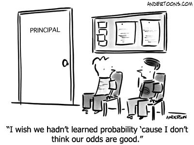

class: title-slide, center, middle

<style>
.center2 {
  margin: 0;
  position: absolute;
  top: 50%;
  left: 50%;
  -ms-transform: translate(-50%, -50%);
  transform: translate(-50%, -50%);
}
</style>

```{r ,warning=F,message=F,echo=F}
library(here)
library(dplyr)
library(knitr)
library(tidyr)
library(purrr)
library(ggplot2)
library(patchwork)
load(here("C5", "Vlaanderen_1_2_3.RData"))
source(here("C5","OLP2 Functies.R"))
library(car)
Vlaanderen_1_2_3$Onderpresteren <- recode(Vlaanderen_1_2_3$ASRIBM01,'1=1;2=1;3=0;4=0;5=0')
Vlaanderen_1_2_3$Gender <- recode(Vlaanderen_1_2_3$ASBG01, '1 = "Girls"; 2 = "Boys"') 
Vlaanderen_1_2_3$Ouders_GraagLezenZ <- scale(Vlaanderen_1_2_3$ASBHPLR) 
library(sjPlot)
```

```{r setup, echo = FALSE}
knitr::opts_chunk$set(fig.retina = 3, warning = FALSE, message = FALSE)
```

```{css echo=FALSE}
.right-column{
  padding-top: 0;
}

.remark-code, .remark-inline-code { font-family: 'Source Code Pro', 'Lucida Console', Monaco, monospace;
                                    font-size: 75%;
                                  }


```


<div class="my-logo-left">  </div>


# GKN - Contactmoment 5
.font160[
.SW-greenD[Logistische regressieanalyses (Deel 1)] 
]
Sven De Maeyer & Bea Mertens

.font80[
.UA-red[
09/12/2021
]
]

---
class: inverse-green, center, middle

# Categorische afhankelijke variabelen

---
## Categorische afhankelijke variabelen

<br>

```{r, out.height = "30%", out.width="30%", eval = T, echo = F, fig.align="center"}

```

---

## Categorische afhankelijke variabelen

Enkele klassiekers:

- Al dan niet slagen;
- Al dan niet doorstromen;
- Al dan niet falen;
- Al dan niet nieuwe job;
- Al dan niet norm halen;
- ...     
<br>    

Maar soms ook handig bij numerieke variabelen ...

---
## Categorische afhankelijke variabelen

Variabelen met meerdere categorieën zijn herleidbaar tot een reeks van .SW-greenD[**dummyvariabelen**]

<br>

Voor elke categorie kan je een variabele maken die aangeeft of een respondent al dan niet tot die categorie behoort

---
## Vb. Onderpresteerders... in PIRLS

Leesvaardigheid van Vlaamse lln. in 5 categorieën ingedeeld (variabele `ASRIBM01`):

1. BELOW 400                     (code 1)
2. AT OR ABOVE 400 BUT BELOW 475 (code 2)
3. AT OR ABOVE 475 BUT BELOW 550 (code 3)
4. AT OR ABOVE 550 BUT BELOW 625 (code 4)
5. AT OR ABOVE 625               (code 5)

<br>

Code 1 en 2 samen vormen een groep van onderpresterende leerlingen

```{r, comment = ""}
table(Vlaanderen_1_2_3$ASRIBM01)
```

---
## Onderpresteerders - afhankelijke var. hercoderen

Eerst **hercoderen**... 

<br>

> Dummyvariabele maken die aanstaat voor 'Onderpresteren' (dus voor leerlingen met code 1 of 2 voor de variabele `ASRIBM01`)

<br>

```{r, echo = T, warning = F, message = F, error = F, comment="", size="tiny", tidy=TRUE}
library(car)
Vlaanderen_1_2_3$Onderpresteren <- recode(Vlaanderen_1_2_3$ASRIBM01,
                                          '1=1;2=1;3=0;4=0;5=0')
table(Vlaanderen_1_2_3$ASRIBM01, Vlaanderen_1_2_3$Onderpresteren)
```

---
## Onderpresteerders - voorspeller? 

> .SW-greenD[*Is het zo dat jongens een grotere kans hebben om onder te presteren dan meisjes?*]

<br>

```{r, echo = T, warning = F, message = F, error = F, comment="", size="tiny", tidy=TRUE}
Vlaanderen_1_2_3$Gender <- recode(Vlaanderen_1_2_3$ASBG01,
                                  "1 = 'Girls'; 2 = 'Boys'") 
kruistabel.kolom(Vlaanderen_1_2_3$Onderpresteren, Vlaanderen_1_2_3$Gender)
```

---
## Onderpresteerders - kansen! (1)

**Wat is de kans op ....?**

1. onderpresteren?    
2. onderpresteren voor jongens?    
3. onderpresteren voor meisjes?    
4. onderpresteren voor meisjes - onderpresteren voor jongens?

<br>

```{r, echo = F, warning = F, message = F, error = F, comment=""}
kruistabel.kolom(Vlaanderen_1_2_3$Onderpresteren , Vlaanderen_1_2_3$Gender)
```

---
## Onderpresteerders - kansen! (2)

**Wat is de kans op....?**

$P(Onderpr.) = .202$

$P(Onderpr.|Boys) = .224$

$P(Onderpr.|Girls) = .180$

$P(Onderpr.|Girls) - P(Onderpr.|Boys) = .180 - .224 = -.044$

---
## Dummy als afhankelijke variabele? (1)

.UA-red[**Waarom niet gewoon dummy als afhankelijke variabele?**]


```{r, echo = T, warning = F, message = F, error = F, size = "tiny", comment=""}
Model_Dummy <- lm(Onderpresteren ~ Gender, data = Vlaanderen_1_2_3)
summary(Model_Dummy)
```

---

## Dummy als afhankelijke variabele? (2)

.SW-greenD[**Kans op onderpresteren voor een meisje?**]

```{r, echo = F, warning = F, message = F, error = F, size = "tiny", comment=""}
summary(Model_Dummy)
```

---

## Dummy als afhankelijke variabele? (3)

.SW-greenD[**Kans op onderpresteren voor een leerling wiens ouders 3 SD hoger dan gemiddeld scoren op Ouders_GraagLezenZ?**]
.footnotesize[
```{r, echo = T, warning = F, message = F, error = F, size = "tiny", comment="", tidy="styler"}
Vlaanderen_1_2_3$Ouders_GraagLezenZ <- scale(Vlaanderen_1_2_3$ASBHPLR) 
Model_Dummy2 <- lm(Onderpresteren ~ Ouders_GraagLezenZ, data = Vlaanderen_1_2_3)
summary(Model_Dummy2)
```
]
---

## Dummy als afhankelijke variabele? (4)

.pull-left[
.footnotesize[
```{r, warning = F , error = F , message = F, eval = F}
library(ggplot2)

Ouders_GraagLezenZ <- seq(-4 , 4 , .05)

Pred_prob_Onderpresteren <- 0.189537 + (-0.060328 * Ouders_GraagLezenZ)

Onzin <- car::recode(
  Pred_prob_Onderpresteren,
  ' -2:-0.0000001 = "Onzin"; 0.0000001:1 = "Geen onzin" '
  )

Onzin <- relevel(as.factor(Onzin), "Onzin")

qplot(x = Ouders_GraagLezenZ,
      y = Pred_prob_Onderpresteren,
      colour = Onzin) + 
  geom_hline(yintercept = 0)

```
]
]

.pull-right[
```{r, warning = F , error = F , message = F, eval = T, echo = F}
library(ggplot2)

Ouders_GraagLezenZ <- seq(-4 , 4 , .05)

Pred_prob_Onderpresteren <- 0.189537 + (-0.060328 * Ouders_GraagLezenZ)

Onzin <- car::recode(
  Pred_prob_Onderpresteren,
  ' -2:-0.0000001 = "Onzin"; 0.0000001:1 = "Geen onzin" '
  )

Onzin <- relevel(as.factor(Onzin), "Onzin")

qplot(x = Ouders_GraagLezenZ,
      y = Pred_prob_Onderpresteren,
      colour = Onzin) + 
  geom_hline(yintercept = 0)
```
]

---

## Problemen met dummyvariabelen als afhankelijke variabele

Probabiliteiten zijn gelimiteerd tussen 0 en 1

<br>

$\rightarrow$  Regressielijn kan onmogelijke waarden bevatten

$\rightarrow$  Kan leiden tot onzinnige schattingen

$\rightarrow$  Hoe meer 'gemiddelde kans' afwijkt van 50%, hoe groter kans op onzinnige schattingen

---
class: inverse-green, center, middle

# Non-lineariteit

---
## Lineaire regressie is hier problematisch!


.pull-left[

```{r, eval = F}
X <- c(rnorm( 40 , mean = -1 , sd = 1), 
       rnorm( 40, mean = 1 , sd = 1))
Y <- c(rep( 0 , 40), 
       rep ( 1 , 40))

qplot(
  x = X,
  y = Y, 
  ylab = 'Probabiliteit', 
  ylim = c(-0.25,1.25)) + 
 geom_abline(slope = 0.25, 
             intercept = 0.50, 
             col="red")

```
]

.pull-right[

```{r, eval = T, echo = F, fig.width = 4, fig.height=4}
set.seed(1975) 

X <- c(rnorm( 40 , mean = -1 , sd = 1), 
       rnorm( 40, mean = 1 , sd = 1))
Y <- c(rep( 0 , 40), 
       rep ( 1 , 40))

qplot(
  x = X,
  y = Y, 
  ylab = 'Probabiliteit', 
  ylim = c(-0.25,1.25)) + 
 geom_abline(slope = 0.25, 
             intercept = 0.50, 
             col="red")

```

*We krijgen aan de uiteinden problemen met onrealistische schattingen... *
]
---
## Oplossing 1


```{r, fig.width = 4, fig.height = 4, echo = F}
set.seed(1975)
X <- c(rnorm( 40 , mean = -1 , sd = 1), rnorm( 40, mean = 1 , sd = 1))
Y <- c(rep( 0 , 40) , rep ( 1 , 40))

D <- data.frame(dx = c(-3.5,-1,1), dy = c(0,0,1), vx = c(-1,1,3.5), vy = c(0,1,1) )
qplot(X,Y, ylab = 'Probabiliteit', ylim = c(-0.25,1.25)) + geom_segment(D, mapping = aes( x = dx, y = dy , xend = vx , yend = vy), color="red", size = 1.25)
```


Dit model is .UA-red[DETERMINISTISCH]: vanaf een bepaalde waarde voor X is de kans gelijk aan 0% of 100%!


---
## Oplossing 2


```{r, fig.width = 4, fig.height = 4, echo=F, message=F}
set.seed(1975)
X <- c(rnorm( 40 , mean = -1 , sd = 1), rnorm( 40, mean = 1 , sd = 1))
Y <- c(rep( 0 , 40) , rep ( 1 , 40))

D <- data.frame(dx = c(-3.5,-1,1), dy = c(0,0,1), vx = c(-1,1,3.5), vy = c(0,1,1) )
qplot(X,Y, ylab = 'Probabiliteit', ylim = c(-0.25,1.25)) + geom_smooth(method = "glm", 
    method.args = list(family = "binomial"), colour=I("red"),
    se = FALSE) 
```

Dit model is 

- .UA-red[REALISTISCHER]: Vanaf een bepaalde waarde voor X benadert de kans 0% of 100%, maar is nooit exact 0% of 100%!

- .UA-red[NIET-LINEAIR]: Kansen nemen niet lineair toe of af overheen de schaal van X

---

## Voorbeelden uit het 'dagelijkse leven' (1)


  
```{r, fig.width = 4, fig.height = 4, echo=F, message=F}
set.seed(1975)
Inkomen <- c(rnorm( 250 , mean = 1500 , sd = 650), rnorm( 250, mean = 2500 , sd = 650))
Prob_Huis <- c(rep( 0 , 250) , rep ( 1 , 250))

qplot(Inkomen,Prob_Huis, ylab = 'Probabiliteit eigen huis') + geom_smooth(method = "glm", 
    method.args = list(family = "binomial"), colour=I("red"),
    se = FALSE) 
```


- Kans om een eigen huis te bezitten is hoger voor gezinnen met hoger inkomen

- Toch ook gezinnen met hoog inkomen die geen eigen huis bezitten en vice versa

- 200€ meer verdienen heeft geen gelijkaardige impact (tussen 1500€ en 2500€ is de impact het sterkst)

---

## Voorbeelden uit het 'dagelijkse leven' (2a)


  
```{r, fig.width = 4, fig.height = 4, echo=F, message=F}
set.seed(1975)
Lichaamslengte <- c(rnorm( 300 , mean = 183 , sd = 8), rnorm( 300, mean = 165 , sd = 7.2))
Prob_Meisje <- c(rep( 0 , 300) , rep ( 1 , 300))

qplot(Lichaamslengte,Prob_Meisje, ylab = 'Probabiliteit Meisje') + geom_smooth(method = "glm", 
    method.args = list(family = "binomial"), colour=I("red"),
    se = FALSE) 
```


- Hoe groter lichaamslengte, hoe kleiner de kans dat het een meisje is

- Toch ook grote meisjes en kleine jongens

- 1cm groter of kleiner zijn heeft geen gelijkaardige impact

---

## Voorbeelden uit het 'dagelijkse leven' (2b)


```{r, fig.width = 4, fig.height = 4, echo=F, message=F}
set.seed(1975)
Lichaamslengte <- c(rnorm( 300 , mean = 162 , sd = 6.2), rnorm( 300, mean = 184 , sd = 7))
Prob_Jongen <- c(rep( 0 , 300) , rep ( 1 , 300))

qplot(Lichaamslengte,Prob_Jongen, ylab = 'Probabiliteit Jongen') + geom_smooth(method = "glm", 
    method.args = list(family = "binomial"), colour=I("red"),
    se = FALSE) 
```

- Net hetzelfde model kan 'gespiegeld' worden!
---
class: inverse-green, center, middle
# Logits

---
## Let's talk in LOGITS...

```{r, out.height = "50%", out.width="50%", eval = T, echo = F, fig.align="center"}

```

---

## Kansen op een andere schaal uitgedrukt

.SW-greenD[.Large[.center2[
Probabiliteiten $\rightarrow$ Odds $\rightarrow$ Logits
]
]
]
---

## Odds

De .UA-red[Odds] voor een 'event' is:

$$
Odds(Y = 1) = \frac{P(Y = 1)}{1-P(Y = 1)} = \frac{P(Y = 1)}{P(Y \ne 1)}
$$

---

## Odds - voorbeeld onderpresteren

Kans op onderpresteren is 0.25 keer groter dan de kans op niet onderpresteren    

Kans op onderpresteren is 1/0.25 keer kleiner dan kans op niet onderpresteren    

<br>

$$
Odds(Onderpr. = 1) = \frac{P(Onderpr. = 1)}{1-P(Onderpr. = 1)} =  \frac{0.202}{0.798}=0.253
$$
<br>

Kans op niet onderpresteren is 4 keer groter dan kans op onderpresteren    

Kans op niet onderpresteren is 1/4 keer kleiner dan kans op onderpresteren    

<br>

$$
Odds(Onderpr. = 0) = \frac{P(Onderpr. = 0)}{1-P(Onderpr. = 0)} =  \frac{0.798}{0.202}=3.95
$$

---

## Enkele odds...

|Probabiliteit |Odds
|:--------------|:------------------|
| 0.10          | (= 0.1/0.9) = 0.11 | 
| 0.30          | 0.43               | 
| 0.50          | 1.00               | 
| 0.70          | 2.33               | 
| 0.90           |9.00               |

<br>
Loopt van $0$ tot $\infty$

---

## Odds zijn echter niet superhandig

- Nog steeds een nulwaarde

- Niet symmetrisch

- Dus niet handig voor lineaire modellen...

---

## Tijd voor logits

.UA-red[Logit] is het natuurlijk logaritme van een Odds:

$$
Logits(Onderpr. = 1) = \ln(Odds) = \ln(0.253) = -1.347
$$

---

## Uitstapje naar ... logaritmes

$$\log_a(x) \rightarrow  a^? = x $$

$$\log_{10}(10) \rightarrow 10^?=10 \rightarrow 10^1=10  $$

$$\log_{10}(1) \rightarrow 10^?=1 \rightarrow 10^0=1  $$

$$\log_{10}(100) \rightarrow 10^?=100 \rightarrow 10^2=100  $$


---

## Natuurlijk logaritme

$$\ln(x) = \log_e(x) \rightarrow  e^? = x $$

met:

$$e=2,718281828$$

$$\ln(1) \rightarrow e^?=1 \rightarrow e^0=1  $$ 

$$\ln(10) \rightarrow e^?=10 \rightarrow e^{2.303}=10  $$

---

## Enkele logits...

|Probabiliteit  |Odds   | Logits |
|:--------------|:------|:-------|
| 0.10          | 0.11  | -2.20 |
| 0.30          | 0.43  | -0.85 |
| 0.50          | 1.00  | 0.00  |
| 0.70          | 2.33  | 0.85  |
| 0.90           |9.00  | 2.20  | 

<br>
- Loopt van $-\infty$ tot $\infty$

- $0$ is midden (=50% kans)

- Symmetrisch!

---

## Verhouding tussen probabiliteiten en logits

.pull-left[
```{r, fig.height=5, fig.width=5, echo = F, warning = F, message=F, error = F}

set.seed(1975)

Probabiliteiten <- seq(0.01,0.99, 
                       by=0.01)

Logits <- log(Probabiliteiten/(1-Probabiliteiten))

Dgraph <- data_frame(Probabiliteiten,Logits)

ggplot(Dgraph,aes(Logits,Probabiliteiten)) + geom_smooth(method = "glm", 
    method.args = list(family = "binomial"), colour=I("red"),
    se = FALSE) 
```
]
.pull-right[
- Elke toename van 1 logit is niet lineair gerelateerd aan toename in probabiliteiten!

- Lineair model in logits gaat gepaard met non-lineair model in probabiliteiten
]

---

## Voorbeeld uit 'dagelijkse leven'


.pull-left[
```{r,fig.height=5, fig.width=5, echo=F,warning =F, error = F, message = F}
set.seed(1975)

Lichaamslengte <- c(rnorm( 300 , mean = 162 , sd = 6.2), rnorm( 300, mean = 184 , sd = 7))
Prob_Jongen <- c(rep( 0 , 300) , rep ( 1 , 300))

DataGender <- data_frame(Lichaamslengte,Prob_Jongen)


DataGender$Predicted_logit_Jongen <- -72.717 + 0.422*DataGender$Lichaamslengte

ggplot(DataGender,aes(Lichaamslengte,Predicted_logit_Jongen, ylab = 'Logit Jongen')) + geom_smooth(method = "lm", 
     colour=I("red"),
    se = FALSE) 
```
]
.pull-right[
```{r,fig.height=5, fig.width=5,warning =FALSE, message=F, echo = F}

DataGender$Predicted_prob_Jongen <- alog(DataGender$Predicted_logit_Jongen) 

ggplot(DataGender,aes(Predicted_logit_Jongen,Predicted_prob_Jongen)) + geom_smooth(method = "glm", 
    method.args = list(family = "binomial"), colour=I("red"),
    se = FALSE) 

```
]
---

##  Voorbeeld uit 'dagelijkse leven'

Het statistisch model achter het verband tussen lengte en kans dat het om een jongen gaat:

$$ Logit(Jongen = 1 ) = -72.717 + 0.422*Lichaamslengte$$
<br>
waarbij   

.UA-red[-72.717] = intercept = Voorspelde **kans in logits** dat het een jongen is als iemand 0 cm lang is     
.UA-red[0.422] = slope = Per cm dat een persoon langer is, neemt **kans in logits** dat het om een jongen gaat met 0.422 logits toe

---

## Voorbeeld uit 'dagelijkse leven'

5 fictieve personen + wat voorspelt ons model        

$$ Logit(Jongen = 1 ) = -72.717 + 0.422*Lichaamslengte$$

| Lengte | Voorspelde logit Jongen      |
|:-------|:-----------------------------|
| 155    |  -72.717 + 0.422*155 = -7.307|
|        |                              |
| 165    |  -72.717 + 0.422*165 = -3.087|
|        |                              |
| 175    |  -72.717 + 0.422*175 = 1.133 |
|        |                              |
| 185    |  -72.717 + 0.422*185 = 5.353 |
|        |                              |
| 195    |  -72.717 + 0.422*195 = 9.573 |

---

## Voorbeeld uit 'dagelijkse leven'

5 fictieve personen + wat voorspelt ons model in logits    

$$ Logit(Jongen = 1 ) = -72.717 + 0.422*Lichaamslengte$$

| Lengte | Voorspelde logit Jongen      | $\Delta$ Logit |
|:-------|:-----------------------------|:---------------|
| 155    |  -72.717 + 0.422*155 = -7.307|                |
|        |                              |  4.22          |
| 165    |  -72.717 + 0.422*165 = -3.087|                |
|        |                              |  4.22          |
| 175    |  -72.717 + 0.422*175 = 1.133 |                |
|        |                              |  4.22          |
| 185    |  -72.717 + 0.422*185 = 5.353 |                |
|        |                              |  4.22          |
| 195    |  -72.717 + 0.422*195 = 9.573 |                |


---

## Voorbeeld uit 'dagelijkse leven'

5 fictieve personen + wat voorspelt ons model in probabiliteiten    

$$ Logit(Jongen = 1 ) = -72.717 + 0.422*Lichaamslengte$$

| Lengte | Voorspelde logit Jongen      | $\Delta$ Logit | Voorspelde Prob. Jongen | $\Delta$ Prob. |
|:-------|:-----------------------------|:---------------|:------------------------|:---------------|
| 155    |  -72.717 + 0.422*155 = -7.307|                | 0.0007                  |                |
|        |                              |  4.22          |                         |  0.0429        |
| 165    |  -72.717 + 0.422*165 = -3.087|                | 0.0436                  |                |
|        |                              |  4.22          |                         | 0.7128         |
| 175    |  -72.717 + 0.422*175 = 1.133 |                | 0.7564                  |                |
|        |                              |  4.22          |                         | 0.2388         |
| 185    |  -72.717 + 0.422*185 = 5.353 |                | 0.9952                  |                |
|        |                              |  4.22          |                         | 0.0047         |
| 195    |  -72.717 + 0.422*195 = 9.573 |                | 0.9999                  |                |


---
class: inverse-green, center, middle

# Logistische regressie in R

---
## Functie .UA-red[`glm( )`]

Werkwijze zeer gelijkaardig aan lineaire regressieanalyse

<br>

Functie `glm( )`

`Model1 <- glm(Jongen ~ Lichaamslengte, data = DataGender, family = binomial())`

<br>

Vervolgens    

`summary(Model1)`

---

## Voorbeeld uit 'dagelijkse leven'

Eerst maken we data aan om mee te werken:

.footnotesize[
```{r, echo = T, warning = F, message = F, error = F, size = "tiny", tidy="tidy"}
set.seed(1975) # Maakt voorbeeld reproduceerbaar
Lichaamslengte <- c(rnorm( 300 , mean = 162 , sd = 6.2), #Genereer 300 waarden met mean 162 en SD 6.2
                    rnorm( 300, mean = 184 ,  sd = 7))   #Genereer 300 waarden met mean 184 en SD 7
Jongen         <- c(rep( 0 , 300), rep ( 1 , 300))

DataGender <- data_frame(Lichaamslengte, Jongen)
```
]

<br>
Dan de analyse:

```{r, echo = T, warning = F, message = F, error = F, size = "tiny"}
Model1 <- glm(Jongen ~ Lichaamslengte, data = DataGender, family = binomial())
```

---
## De output

.footnotesize[
```{r, echo = T, warning = F, message = F, error = F, size = "tiny", comment=""}
summary(Model1)
```
]

---
## Welke kans ben je aan het voorspellen?

.SW-greenD[*Kans dat het een jongen is of kans dat het een meisje is?*]

<br>

Hier: dummy die aanstaat voor jongen!

<br>
Standaard: 

- Hoogste categorie (bv. waarde 1 bij een dummy)

- of laatste categorie alfabetisch (bv. categorie "Meisje" indien de variabele categorieën "Meisje" en "Jongen" heeft)

---
## De voorbeelddata

We maken enkele varianten van de variabele geslacht.    
Vervolgens herschatten we model met elke variant als afhankelijke variabele.


```{r, echo = T, warning = F, message = F, error = F, size = "tiny", comment = "", tidy="styler"}
DataGender$Meisje   <- c(rep( 1 , 300) , rep ( 0 , 300))
DataGender$Geslacht <- as.factor(c(rep( "Meisje" , 300) , rep ( "Jongen" , 300)))

M1_Meisje   <- glm(Meisje ~ Lichaamslengte,   data = DataGender, family = binomial())
M1_Geslacht <- glm(Geslacht ~ Lichaamslengte, data = DataGender, family = binomial())

coefficients(Model1)

coefficients(M1_Meisje)

coefficients(M1_Geslacht)

```

---
## Veranderen van referentiecategorie

De functie .UA-red[`relevel( )`]

.footnotesize[
```{r, echo = T, warning = F, message = F, error = F, size = "tiny", comment="", tidy="tidy"}
DataGender$Geslacht_x <- relevel(DataGender$Geslacht, 2)
M1_Geslacht_x         <- glm(Geslacht_x ~ Lichaamslengte, data = DataGender, family = binomial())
summary(M1_Geslacht_x)
```
]
---
## Onderpresteerders - meerdere voorspellers

Effect van 'Gender' en 'Ouders_GraagLezenZ' op kans op onderpresteren ?

.footnotesize[
```{r, echo = T, message = F, comment="", warning = F, error = F, size = "tiny", tidy="tidy"}
M1_PIRLS <- glm(Onderpresteren ~ Gender + Ouders_GraagLezenZ, 
                data = Vlaanderen_1_2_3, family = binomial())
summary(M1_PIRLS)
```
]

---
## .UA-red[`alog( )`] functie - PIRLS voorbeeld

Voor interpretatie handiger om in probabiliteiten te spreken

$$P(x = 1) = \frac{e^{logit(x=1)}}{1+e^{logit(x=1)}}$$
<br>
Bv. Kans op onderpresteren voor een jongen is -1.376 logits (~ intercept)    
<br>
In `R`
```{r, echo = T, size = "tiny", comment=""}
exp(-1.376)/(1+exp(-1.376))
```


Handiger: functie `alog( )` uit "OLP2 Functies.R"
```{r, echo = T, size = "tiny", comment=""}
alog(-1.376)
```

---

## .UA-red[`alog( )`] functie - PIRLS voorbeeld

```{r, echo = T, size = "tiny", comment=""}
# Probabiliteit tot onderpresteren voor jongens:
alog(-1.376)

# Probabiliteit tot onderpresteren voor meisjes:
alog(-1.376 - 0.254)

# Verschil in probabiliteit tot onderpresteren tussen jongens en meisjes:
alog(-1.376) - alog(-1.376 - 0.254)
```

---

## .UA-red[`alog( )`] functie - PIRLS voorbeeld

Bij kwantitatieve voorspellers (bv. Ouders_GraagLezenZ) fictieve respondenten als voorbeeld hanteren:


```{r, echo = T, size = "tiny", comment=""}
# Probabiliteit tot onderpresteren voor een jongen die gemiddeld scoort:
alog(-1.376)

# Probabiliteit tot onderpresteren voor een jongen die 2 st.dev. hoger dan gemiddeld scoort:
alog(-1.376 + 2 * -0.394)

# Probabiliteit tot onderpresteren voor een jongen die 2 st.dev. lager dan gemiddeld scoort:
alog(-1.376 - 2 * -0.394)

```

---

## Grafisch samenvatten van model

Functie .UA-red[`plot_model()`] uit het pakket .UA-red[`sjPlot`] (*niet in OLP!*)

.pull-left[
```{r, echo = T, eval = F, fig.width = 5, fig.height=5, warning = F, message = F, error = F}
library(sjPlot)

plot_model(M1_PIRLS, 
           transform = NULL, 
           type = "eff", 
           terms = c("Ouders_GraagLezenZ")
           )
```
]

.pull-right[
```{r, echo = F, eval = T, fig.width = 5, fig.height=5, warning = F, message = F, error = F}
library(sjPlot)

plot_model(M1_PIRLS, 
           transform = NULL, 
           type = "eff", 
           terms = c("Ouders_GraagLezenZ")
           )
```
]
---

## Grafisch samenvatten van model

.pull-left[
```{r, echo = T, eval = F, fig.width = 5, fig.height=5, warning = F, message = F, error = F}
library(sjPlot)

plot_model(M1_PIRLS, 
           transform = NULL, 
           type = "eff", 
           terms = c("Ouders_GraagLezenZ", "Gender")
           )
```
]

.pull-right[
```{r, echo = F, eval = T, fig.width = 5, fig.height=5, warning = F, message = F, error = F}
library(sjPlot)

plot_model(M1_PIRLS, 
           transform = NULL, 
           type = "eff", 
           terms = c("Ouders_GraagLezenZ", "Gender")
           )
```
]

---

## Interactie-effecten - PIRLS voorbeeld

Interactie-effect van 'Gender' en 'Ouders_GraagLezenZ' op kans op onderpresteren?
.footnotesize[
```{r, echo = T, message = F, warning = F, comment="", error = F, size = "tiny", tidy="tidy"}
M2_PIRLS <- glm(Onderpresteren ~ Gender + Ouders_GraagLezenZ + Gender*Ouders_GraagLezenZ, 
                data = Vlaanderen_1_2_3, family = binomial())
summary(M2_PIRLS)
```
]
---

## Grafisch samenvatten van model

.pull-left[
```{r, echo = T, eval = F, fig.width = 5, fig.height=5, warning = F, message = F, error = F}
library(sjPlot)

plot_model(M2_PIRLS, 
           transform = NULL, 
           type = "eff", 
           terms = c("Ouders_GraagLezenZ", "Gender")
           )
```
]

.pull-right[
```{r, echo = F, eval = T, fig.width = 5, fig.height=5, warning = F, message = F, error = F}
library(sjPlot)

plot_model(M2_PIRLS, 
           transform = NULL, 
           type = "eff", 
           terms = c("Ouders_GraagLezenZ", "Gender")
           )
```
]


---
class: inverse-red, middle, center

# Time to pRactice!

<p align = "left">
Instructies: 
<br>
- Laat deze sessie open staan
<br>
- Open Blackboard opnieuw in een ander venster
<br>
- Ga naar de curusus GKN
<br>
- Ga naar de Blackboard Collaborate omgeving van je groep
<br>
- Zet je microfoon/video aan
<br><br>
Eén van ons maakt zo meteen een ronde langs de groepen!
</p> 
---

## ExtRa's
Zit je te popelen om te weten ...

- hoe je toch random slopes voor kwalitatieve variabelen kan plotten zonder foutmelding?
- hoe je multilevel analyse gebruikt om longitudinale analyses te doen?

<br>

Check Blackboard (Leermateriaal > Materiaal per week)
