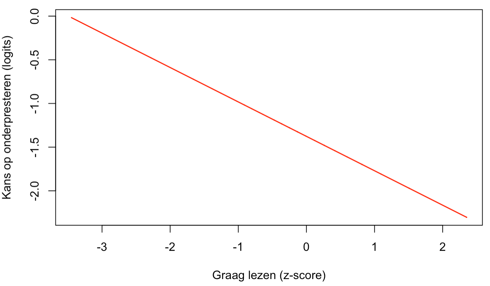
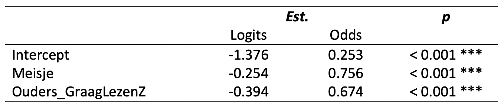

class: title-slide, center, middle

<style>
.center2 {
  margin: 0;
  position: absolute;
  top: 50%;
  left: 50%;
  -ms-transform: translate(-50%, -50%);
  transform: translate(-50%, -50%);
}
</style>

```{r ,warning=F,message=F,echo=F}
library(here)
library(dplyr)
library(knitr)
library(tidyr)
library(purrr)
library(ggplot2)
library(patchwork)
load(here("C6", "Vlaanderen_1_2_3.RData"))
source(here("C6","OLP2 Functies.R"))
library(car)
Vlaanderen_1_2_3$Onderpresteren <- recode(Vlaanderen_1_2_3$ASRIBM01,'1=1;2=1;3=0;4=0;5=0')
Vlaanderen_1_2_3$Gender <- recode(Vlaanderen_1_2_3$ASBG01, '1 = "Girls"; 2 = "Boys"') 
Vlaanderen_1_2_3$Ouders_GraagLezenZ <- scale(Vlaanderen_1_2_3$ASBHPLR) 
M1_PIRLS <- glm(Onderpresteren ~ Gender + Ouders_GraagLezenZ, 
                data = Vlaanderen_1_2_3, family = binomial())
library(sjPlot)
```

```{r setup, echo = FALSE}
knitr::opts_chunk$set(fig.retina = 3, warning = FALSE, message = FALSE)
```

```{css echo=FALSE}
.right-column{
  padding-top: 0;
}

.remark-code, .remark-inline-code { font-family: 'Source Code Pro', 'Lucida Console', Monaco, monospace;
                                    font-size: 75%;
                                  }


```


<div class="my-logo-left">  </div>


# GKN - Contactmoment 6
.font160[
.SW-greenD[Logistische regressieanalyses (Deel 2)] 
]
Sven De Maeyer & Bea Mertens

.font80[
.UA-red[
23/12/2021
]
]

---
class: inverse-green, center, middle

# Recap

---
## Laatste model vorig contactmoment

.footnotesize[
```{r ,warning=F,message=F,echo=F,size="tiny", tidy="tidy", tidy.opts=list(width.cutoff=50), comment=""}
summary(M1_PIRLS)
```
]

---
## Effect van 'Ouders_GraagLezenZ'

.pull-left[
```{r, eval = T, echo = F, fig.align="center"}

```

]

.pull-right[
```{r , eval = T, echo = F, fig.align="center"}
knitr::include_graphics("PlotPROB.png")
```
]

---

## Effect van 'Gender'

```{r, echo = T, fig.width=6, fig.height=6, warning = F, message = F, error = F, fig.align ='center'}
library(sjPlot)
plot_model(M1_PIRLS, transform = NULL, type = "eff", terms = c("Gender"))
```

---


## Beide effecten samen?

```{r, echo = T, fig.width=6, fig.height=6, warning = F, message = F, error = F, fig.align ='center'}
plot_model(M1_PIRLS, transform = NULL, type = "eff", terms = c("Ouders_GraagLezenZ", "Gender"))
```

---
class: inverse-green, middle, center

# Odds

*Let's talk in Odds*

---

## Parameters als Odds interpreteren (1)

<br>

Het model kunnen we schrijven als: 

$$Logit(Onderpr. = 1 ) = -1.376 + (-0.254*GenderGirl) + (-0.394*OudersLezenZ)$$

Nemen we de exponent (.SW-greenD[`exp( )`] ) van het intercept, dan krijgen we Odds (= verhouding van kansen!)

```{r, echo = T, comment=""}
exp(-1.376)
```


*Voor jongens wiens ouders gemiddeld graag lezen is de kans om te behoren tot de onderpresteerders .SW-greenD[0.25 keer groter (of 1/0.25 = 4 keer kleiner)] dan de kans om niet tot de onderpresteerders te behoren*

---

## Parameters als Odds interpreteren (2)

*.SW-greenD[Hoe de andere parameters interpreteren als we ze exponeren?]*

$$Logit(Onderpr. = 1 ) = -1.376 + (-0.254*GenderGirl) + (-0.394*OudersLezenZ)$$


```{r, echo = T, size = "tiny", comment=""}
exp(-0.254)
1/exp(-0.254)
```

*Voor meisjes wiens ouders gemiddeld graag lezen is de .SW-greenD[kansverhouding] om te behoren tot de onderpresteerders eerder dan tot de 'niet onderpresteerders' 0.776 keer groter (of 1/0.776 = 1.289 keer kleiner) dan voor jongens*

<br>

0.776 is een **.UA-red[Odds Ratio]**

---

## Parameters als Odds interpreteren (3)

```{r, out.height = "50%", out.width="50%", eval = T, echo = F, fig.align="center"}

```


<br>

Voorspelde Odds voor meisjes:

```{r, echo = T, size = "tiny", comment=""}
## Voorspelde Odds meisjes:
exp(-1.376) * exp(-0.254)
```

*Voor jongens (wiens ouders gemiddeld graag lezen) is de kans .SW-greenD[0.25 keer groter (of 1/0.25 = 4 keer kleiner)] dan de kans om niet tot de onderpresteerders te behoren.*

*Voor meisjes (wiens ouders gemiddeld graag lezen) is de kans .SW-greenD[0.19 keer groter (of 1/0.19 = 5 keer kleiner)] dan de kans om niet tot de onderpresteerders te behoren.*
   
Odds zijn **multiplicatief**

---
class: inverse-green, center, middle

# Het ene model is het andere niet

Hoe goed zijn modellen?

---

## Geen $R^2$

Bij gewone regressie-analyse hebben we een geschat residu:

$$Score_{i}= \beta_0 + \beta_1 * x_1 + \beta_2 * x_2 + ... + \epsilon_{ij}$$

<br>

Gewone regressieanalyse: *Ordinary Least Squares* (OLS) schattingen     


Schattingen die de afstand van de regressielijn met de residuen minimaliseert!

---

## Maximum Likelihood

Bij logistische regressieanalyse hebben we geen geschat residu!

$$Logit(X=1)= \beta_0 + \beta_1 * x_1 + \beta_2 * x_2 +...$$

<br>

Logistische regressieanalyse: .UA-red[Maximum Likelihood] (ML) schattingen

---

## Maximum Likelihood


Likelihood = functie van parameterwaarden (gegeven de data)!

Doel: die combinatie van parameterwaarden waarvoor de Likelihood zo hoog mogelijk is (=Maximaal)

Hoe? 

- Likelihood wordt eerst log-getransformeerd 
- Via 'afgeleiden' van Log-likelihood functie parameterwaarden waarvoor de log-likelihood maximaal is

$\rightarrow$ Voor een model krijgen we ook een .UA-red[Log-likelihood (LL)] waarde (= indicatie van FIT!)

---

## Modellen vergelijken

.center2[
<br>
2 concurrerende modellen, welk model zou je weerhouden?

<br>
<br>

$\rightarrow$ Model met hoogste waarde voor LL!
<br>

]

---
## Nulmodel als start

Nulmodel = model zonder voorspellers

.footnotesize[
```{r ,warning=F,message=F,echo=T,size="tiny", tidy="tidy", comment=""}
M0_PIRLS <- glm(Onderpresteren ~ 1, 
                data = Vlaanderen_1_2_3, family = binomial())
summary(M0_PIRLS)
```
]

---

## Vergelijking met Model1

```{r ,warning=F,message=F,echo=T,size="tiny", comment=""}
logLik(M0_PIRLS)
logLik(M1_PIRLS)
```

<br>
<br>

In onderzoek wordt -2 keer LL gehanteerd (= **-2LL** of **Deviance**)

```{r ,warning=F,message=F,echo=T,size="tiny", comment=""}
deviance(M0_PIRLS)
deviance(M1_PIRLS)
```

---

## Via .UA-red[`anova()`]

```{r ,echo=T,size="tiny", eval = F, error=T, comment=""}
anova(M0_PIRLS , M1_PIRLS)
```

<br>
<br>

$\rightarrow$ .UA-red[`Error in anova.glmlist(c(list(object), dotargs), dispersion = dispersion, : models were not all fitted to the same size of dataset`]

---

## Vergelijking modellen (invloed van 'missing values')

Modellen kunnen enkel vergeleken worden als ze geschat zijn op dezelfde dataset (en dus ook op evenveel observatie-eenheden)!

```{r, echo = T, error = F, comment=""}
nrow(M0_PIRLS$model)
nrow(M1_PIRLS$model)
```

$\rightarrow$ Nulmodel herschatten op enkel de 4635 observaties om model te kunnen vergelijken

---

## Vergelijking modellen

Missing values verwijderen:

```{r ,warning=F,message=F,echo=T,size="tiny", tidy="tidy", tidy.opts=list(width.cutoff=50), comment=""}
Dat_analyse <- na.omit( Vlaanderen_1_2_3[ , c("Onderpresteren", "Gender", "Ouders_GraagLezenZ")] )
```

Modellen herschatten:

```{r ,warning=F,message=F,echo=T,size="tiny", tidy="tidy", tidy.opts=list(width.cutoff=50), comment=""}
M0_PIRLS <- glm(Onderpresteren ~ 1, 
                data = Dat_analyse, family = binomial())

M1_PIRLS <- glm(Onderpresteren ~ Gender + Ouders_GraagLezenZ, 
                data = Dat_analyse, family = binomial())
```

Modellen vergelijken:

```{r ,warning=F,message=F,echo=T,size="tiny", tidy="tidy", tidy.opts=list(width.cutoff=50), comment=""}
anova(M0_PIRLS , M1_PIRLS, test="Chi")
```

---

## Vergelijking modellen

Stappenplan:

- Nadenken over welke modellen je gaat schatten (gegeven je OV)

- Data-object maken zonder missings voor alle variabelen `na.omit()`

- Alternatieve modellen schatten op aangemaakt data-object

- Modellen vergelijken 

- Beste model weerhouden en **herschatten op je originele dataset**

- Interpretatie (Nadenken over tabellen en figuren)

---
class: inverse-red, middle, center

# Time to pRactice!

<p align = "left">
Instructies: 
<br>
- Laat deze sessie open staan
<br>
- Open Blackboard opnieuw in een ander venster
<br>
- Ga naar de curusus GKN
<br>
- Ga naar de Blackboard Collaborate omgeving van je groep
<br>
- Zet je microfoon/video aan
<br><br>
Eén van ons maakt zo meteen een ronde langs de groepen!
</p> 
